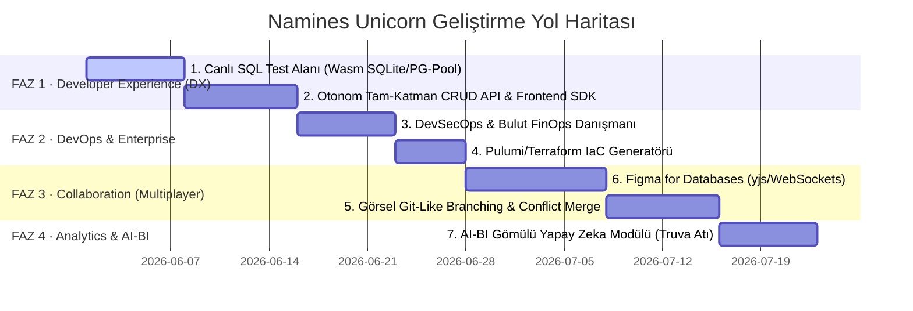
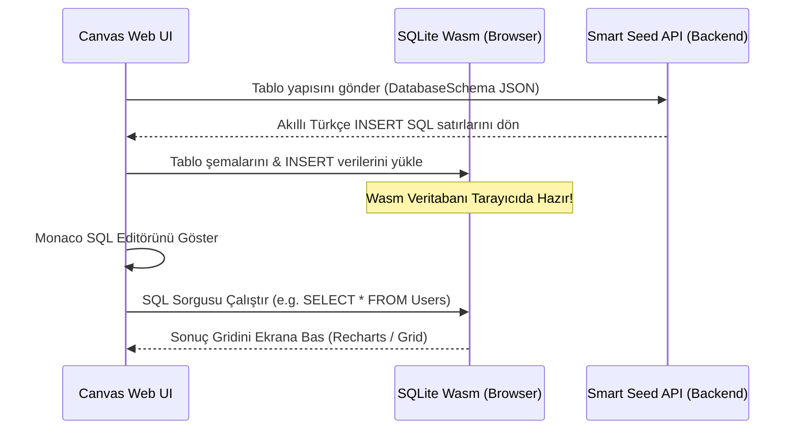
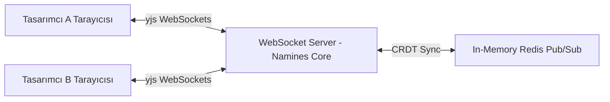

# Namines Unicorn Roadmap: The 7 Ultimate Innovations Implementation Plan

Bu mimari plan; Namines veritabanı platformunu sektörün zirvesine taşıyacak ve milyar dolarlık bir girişim (Unicorn) haline getirecek **7 Nihai İnovasyonun** adım adım hayata geçirilme stratejisini, teknik altyapısını, mimari detaylarını ve öncelik sıralamasını (Önem ve Uygulama Matrisi) kurumsal düzeyde sunmaktadır.

---

## 🗺️ 1. Stratejik Önceliklendirme ve Uygulama Matrisi (Execution Sequence)

7 büyük inovasyon, teknik bağımlılıklar (dependencies), geliştirme çabası ve pazara sunma hızı (Time-to-Market) göz önünde bulundurularak **4 mantıksal faza** bölünmüştür.

### 📊 Öncelik ve Uygulama Matrisi

| Uygulama Sırası | Özellik Adı | Kategori | Çaba Seviyesi | B2B / SaaS Değeri | Teknik Bağımlılıklar |
| :--- | :--- | :--- | :--- | :--- | :--- |
| **1 (FAZ 1)** | **Tarayıcı İçi Canlı SQL Test Alanı** | DX / Retention | Orta | Çok Yüksek | Smart Seeding, SQLite-Wasm / PG-Pool |
| **2 (FAZ 1)** | **Otonom CRUD API & Frontend SDK** | DX | Orta-Yüksek | Çok Yüksek | EF Core / Generators, Swagger parser |
| **3 (FAZ 2)** | **DevSecOps & Bulut FinOps Danışmanı**| Enterprise | Orta | Çok Yüksek | AI DBA, AWS/Azure Pricing API |
| **4 (FAZ 2)** | **Zero-to-Cloud IaC Generatörü** | DevOps | Düşük-Orta | Yüksek | Docker, Terraform/Pulumi templates |
| **5 (FAZ 3)** | **Eşzamanlı Tasarım Odaları (Figma)** | İşbirliği | Yüksek | Çok Yüksek | yjs, WebSocket Server, WebRTC |
| **6 (FAZ 3)** | **Görsel Git-Like Şema Dallanması** | Sürüm Yönetimi| Yüksek | Çok Yüksek | Stable UUID, Visual Diff UI |
| **7 (FAZ 4)** | **AI-BI (Business Intelligence) Modülü**| Premium Analytics| Orta | Yüksek | LLM Text-to-SQL, ChartJS/Recharts |

---

## 🛠️ 2. Derinlemesine Mimari ve Teknik İşleyiş Planları

---

### 🎮 FAZ 1.1: Tarayıcı İçi Canlı SQL Test Alanı (Live SQL Explorer)

Kullanıcıların tasarladıkları veritabanını tarayıcıda hemen çalıştırıp sorgulayabilecekleri, mock verilerle beslenmiş canlı bir oyun alanı.

#### Teknik Altyapı ve Akış:
* **Hafif Çalıştırma Motoru (SQLite-Wasm & PG-Pool):**
  * Ağır MSSQL yerine, tarayıcıda doğrudan çalışan **`sql.js` (SQLite WebAssembly)** motoru entegre edilecektir. 
  * Kullanıcı veritabanı tipi olarak PostgreSQL/MySQL seçse dahi, SQL DDL şeması SQLite uyumlu tipe compile edilerek tarayıcı içi veritabanı ayağa kaldırılacaktır.
* **Smart Seeding Otomasyonu:**
  * Şema hazırlandığı an, backend `/api/smartseed/generate` servisi aracılığıyla 100'er satırlık gerçekçi Türkçe test verileri (`INSERT INTO ...`) otonom üretilip bu yerel Wasm veritabanına basılacaktır.
* **Monaco Editor & SQL Grid:**
  * Tarayıcıda bir terminal ve SQL editörü (Monaco Editor / SQL Syntax) açılacaktır.
  * Kullanıcı sorgu çalıştırdığında, sorgu doğrudan tarayıcı içi veritabanında koşturulacak ve sonuçlar zengin bir glassmorphic grid tablosunda gösterilecektir.

---

### ⚡ FAZ 1.2: Otonom CRUD API & Frontend SDK Üreticisi

Veritabanından hemen ayağa kalkacak kurumsal düzeyde backend mikroservis projesi ve Next.js/React frontend ekipleri için tip-güvenli istemci SDK'sı üretimi.

#### Teknik Altyapı ve Akış:
* **ASP.NET Core 9.0 Clean Architecture Scaffolder (C#):**
  * Backend tarafında, .NET şablon motoru (`T4 Templates` veya `Liquid Templates` tabanlı `Scriban` motoru) kurulacaktır.
  * Şema onaylandığı an, şu katmanlar otonom oluşturulacaktır:
    * `Domain:` Entity sınıfları, Enums, Value Objects.
    * `Application:` CQRS MediatR Handlers, FluentValidation validation kuralları, DTOs.
    * `Infrastructure:` EF Core `DbContext`, repository implementasyonları, Migrations.
    * `API:` Swagger, JWT Auth, Dockerfile, Controller sınıfları.
* **React/Next.js Type-Safe SDK Generatörü:**
  * Backend modellerinden Next.js projelerinde kullanılmak üzere API istemci kodları üretilir:
    * **Zod Schemas:** Input doğrulama kuralları (`const UserSchema = z.object({ ... })`).
    * **TypeScript Types:** Tüm istek ve yanıt tipleri.
    * **Axios & TanStack Query (React Query) Hooks:** Her tablo için otonom `useQuery` ve `useMutation` hook'ları (örneğin: `useCreateUserMutation()`, `useGetOrdersQuery()`).
* **Paketleme:** Tüm bu kod ağacı `ZipArchive` API'si ile sıkıştırılarak `.zip` olarak indirilmeye sunulacaktır.

---

### 🛡️ FAZ 2.1: DevSecOps & Bulut FinOps Danışmanı

Enterprise B2B satışlarını patlatacak, şemadaki güvenlik açıklarını yamayan ve bulut veri tabanı faturasını minimize eden AI DBA asistanı.

#### Teknik Altyapı ve Akış:
* **DevSecOps (Veri Güvenlik Kalkanı):**
  * AI DBA linter motoru, şema kolon isimlerini anlamsal (Semantic) olarak tarar.
  * Eğer `CreditCard`, `PasswordHash`, `IdentityNo` / `TCKN`, `PhoneNumber` gibi hassas veriler barındıran kolonlar algılarsa, C# kod üretim şablonlarına otonom veri maskeleme (Hashing, Salted BCrypt, SHA-256 veya AES-256 şifreleme) niteliklerini (`[Encrypted]`, `[Protected]`) ekler.
* **FinOps (Bulut Maliyet Danışmanı):**
  * Şemadaki veri tipleri ve boyut limitleri (`NVARCHAR(MAX)` vs.) taranır.
  * AWS RDS, Azure SQL ve GCP Cloud SQL'in güncel fiyat tarifeleri backend veri tabanına senkronize edilir.
  * AI, şemanın aylık disk ve işlem gücü yükünü simüle ederek faturayı optimize edecek DDL komutları önerir:
    > 💡 **AI FinOps Analizi:** *"Orders tablosundaki `Address` kolonu `NVARCHAR(MAX)` yerine `NVARCHAR(500)` olarak değiştirildi. Bu değişiklik sayesinde veritabanı IOPS tüketimi %40 azalacak ve AWS Aurora üzerinde d3.medium yerine d3.micro ($140/ay ➔ $35/ay) sunucu katmanına geçiş mümkün olacaktır."*

---

### ☁️ FAZ 2.2: Zero-to-Cloud: Infrastructure as Code (IaC) Generatörü

Üretilen veritabanı ve API'nin bulut sağlayıcılarda tek tıkla ayağa kaldırılmasını sağlayan altyapı kod otomasyonu.

#### Teknik Altyapı ve Akış:
* **Terraform / Pulumi Kod Generatörü:**
  * ZIP paketinin içine, seçilen bulut sağlayıcısına uygun altyapı kodları gömülür:
    * **Terraform:** `main.tf`, `variables.tf`, `outputs.tf` dosyaları (AWS RDS PostgreSQL, VPC, Security Groups, IAM Roles kurulumlarıyla).
    * **Pulumi (C# veya TypeScript):** Programatik bulut kurulumu kodları.
* **CI/CD Pipelines (GitHub Actions / GitLab CI):**
  * `.github/workflows/deploy.yml` otonom üretilir.
  * Kullanıcı kodunu GitHub repository'sine yüklediğinde, Docker build alınarak AWS ECR / Azure ACR'ye push edilir ve Terraform ile VPC üzerinden buluta otonom deploy edilir.

---

### 👥 FAZ 3.1: Eşzamanlı Tasarım Odaları (Figma for Databases)

Birden fazla mimarın aynı diyagram üzerinde gerçek zamanlı, imleç hareketleri ve tablo güncellemeleriyle çalışmasını sağlayan WebSocket odaları.

#### Teknik Altyapı ve Akış:
* **Real-time Synchronization Engine (Yjs & WebSocket):**
  * CRDT (Conflict-free Replicated Data Type) tabanlı **Yjs** kütüphanesi frontend'e entegre edilir.
  * Zustand store'undaki `nodes` ve `edges` durumları, Yjs paylaşılan dökümanına (`Y.Doc`) bağlanır.
  * Node hareketleri, tablo ekleme ve silme işlemleri WebSocket yayını üzerinden tüm bağlı istemcilere milisaniyeler içinde yayılır.
* **Presence & Cursors (İmleç Takibi):**
  * WebSocket bağlantısı üzerinden her kullanıcının ekran üzerindeki X ve Y imleç koordinatları ve kullanıcı ismi (`presence metadata`) yayınlanır. Ekranda Figma tarzı neon renkli parıldayan imleçler render edilir.

---

### 🌿 FAZ 3.2: Görsel Git-Like Şema Versiyon Kontrolü (Branching & Merging)

Veritabanı şemasında görsel olarak dallanmalar yapabilme, farkları Git mantığıyla görselleştirme ve çakışmaları sürükle-bırak çözerek birleştirme (merge) motoru.

#### Teknik Altyapı ve Akış:
* **Görsel Dallanma (Visual Branching):**
  * Zustand store IndexedDB (localforage) üzerinde, mevcut şemanın o anki durumunu klonlayarak `feature/dal-adi` adında yeni bir local şema kopyası oluşturur. `main` şeması dondurulur.
* **Görsel Diff Motoru (Visual Diff):**
  * İki dal birleştirilmek istendiğinde, backend `/api/migration/diff` servisine şemalar gönderilir ve StableUuid bazlı diff çıkarılır.
  * Canvas üzerindeki değişiklikler renklendirilir:
    * **Eklenen Tablo/Kolon:** Yeşil neon çerçeve (`border-emerald-500 bg-emerald-500/10`)
    * **Silinen Tablo/Kolon:** Kırmızı neon çerçeve (`border-rose-500 bg-rose-500/10`)
    * **Değişen Alanlar:** Sarı neon çerçeve (`border-amber-500 bg-amber-500/10`)
* **Görsel Merge Conflict Çözücü:**
  * Aynı tablo üzerinde çakışma varsa (örneğin iki mimar da `Id` kolonunun tipini farklı değiştirdiyse), tarayıcıda yan yana iki tablo kartı gösterilir. Kullanıcı tercih ettiğini seçerek çakışmayı otonom çözer ve `Merge Complete` komutuyla `main` şemayı günceller.

---

### 📊 FAZ 4.1: AI-BI (Business Intelligence) Modülü

İndirilen projelerin içine gömülen ve teknik olmayan iş yöneticilerinin bile veritabanıyla konuşarak görsel grafik raporlar üretmesini sağlayan Truva Atı yapay zeka modülü.

#### Teknik Altyapı ve Akış:
* **Gömülü AI-BI Modülü (Truva Atı):**
  * Üretilen C# veya NestJS REST API projesinin içine `/api/bi/query` adında hazır bir controller ve şık bir frontend Admin paneli eklentisi gömülür.
* **Doğal Dilden Güvenli SQL Motoru (Text-to-SQL):**
  * Kullanıcı arayüze *"Sakarya şubesindeki son 3 ayın satış trendini çiz"* yazar.
  * Gömülü BI modülü, şema yapısını (yalnızca metadata, gerçek veriyi dışarı sızdırmadan) Namines LLM API'sine gönderir.
  * LLM, veritabanına özel salt-okunur (Read-Only) SQL sorgusunu üretir.
  * BI modülü sorguyu yerel veritabanında çalıştırır, dönen ham veriyi anında grafik formatına dönüştürerek (Chart.js / Recharts ile) yönetici ekranına interaktif çizgi, bar veya pasta grafiği olarak basar.

---

## 🧭 3. Yönetici Aksiyon Planı ve Fazlandırma Takvimi

Süreci en hızlı şekilde pazar lansmanına (Beta launch) yetiştirmek için aksiyon planımız şu şekildedir:

### 🚀 Faz 1: Developer Experience (Hafta 1 - 2)
> [!TIP]
> **Amaç:** Geliştiricileri sisteme aşık etmek ve viral etki yaratmak.
> * Tarayıcıda SQLite-Wasm entegrasyonunun tamamlanması.
* Monaco Editor SQL Playground ekranının canvas'a entegrasyonu.
* C# Clean Architecture API generator şablonlarının ve Next.js SDK yazıcısının kodlanması.

### ☁️ Faz 2: Enterprise & Cloud DevOps (Hafta 3 - 4)
> [!IMPORTANT]
> **Amaç:** B2B şirketlere satış kapılarını aralamak.
* AI DBA linter modülüne anlamsal veri tipi maskeleme kurallarının eklenmesi.
* AWS ve Azure veri tabanı fiyatlama API'lerinin FinOps motoruna bağlanması.
* Pulumi ve Terraform IaC şablonlarının entegrasyonu, GitHub Actions CI/CD otomasyonunun yazılması.

### 👥 Faz 3: Takım Çalışması & Figma Mode (Hafta 5 - 6)
> [!CAUTION]
> **Amaç:** Ekip lisansı (Team/Organization Plan) satışlarını başlatmak.
* Node ve Edge koordinatlarını WebSocket üzerinden CRDT (yjs) ile senkronize eden WebSocket sunucu altyapısı.
* Eşzamanlı imleç takibi (Figma mode Cursors) tasarımı.
* Stable UUID altyapısı üzerinden Görsel Git Dallanma (Branch/Merge MR) arayüzlerinin canvasa giydirilmesi.

### 📊 Faz 4: AI-BI Premium Analytics (Hafta 7)
> [!NOTE]
> **Amaç:** İndirilen kod paketlerine premium eklenti satmak.
* Proje şablonlarının içine gömülecek `/api/bi` Text-to-SQL controller katmanının yazılması.
* Tarayıcıda otonom grafik üreten Admin Paneli BI UI modülünün kodlanması.

---

## 🔬 4. Doğrulama ve Test Planı

1. **Live SQL Explorer Testleri:**
   * SQLite Wasm motorunun tarayıcı thread'ini kitlemeden Web Worker üzerinde izole çalışıp çalışmadığı.
   * `SELECT` dışındaki yıkıcı (`DROP`, `DELETE`) SQL komutlarının sandboxta kısıtlanması/yakalanması testi.
2. **Scaffolder & SDK Testleri:**
   * Üretilen ZIP paketinin `dotnet run` ve `npm run dev` komutlarıyla yerelde sıfır hata ile ayağa kalktığının doğrulanması.
3. **Collaboration & WebSocket Testleri:**
   * Aynı diyagramda eşzamanlı 10 kullanıcının aynı anda yaptığı tablo güncellemelerinde veri çakışması (merge integrity) testi.
