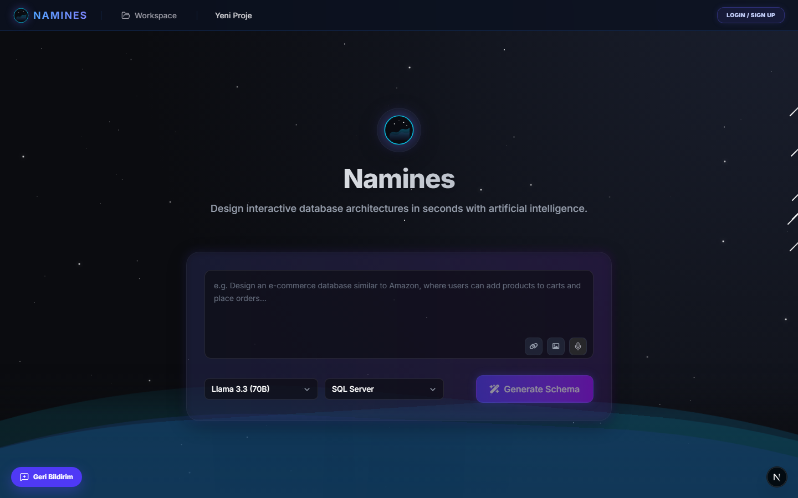
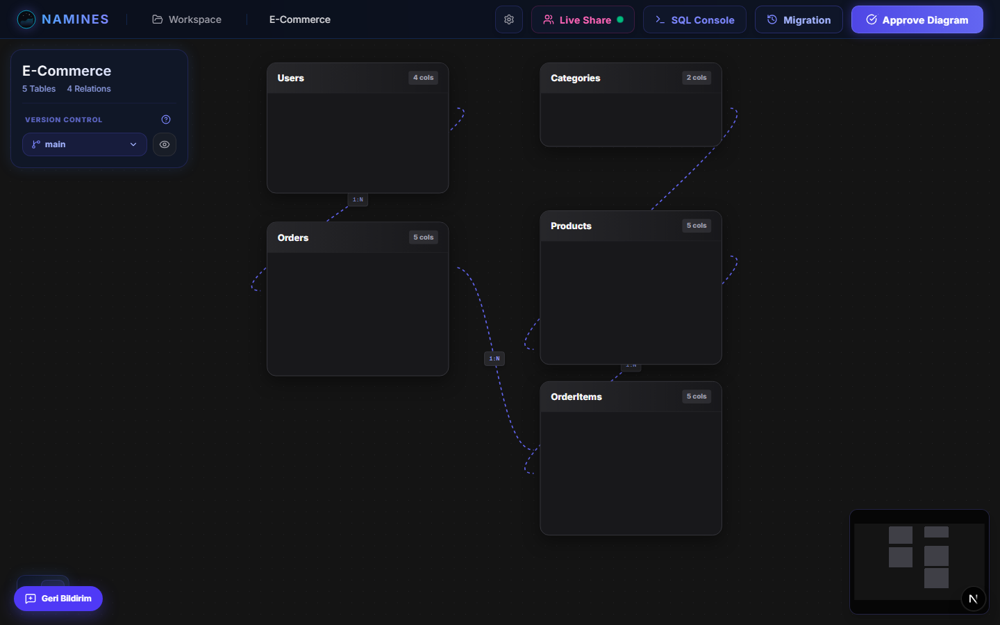
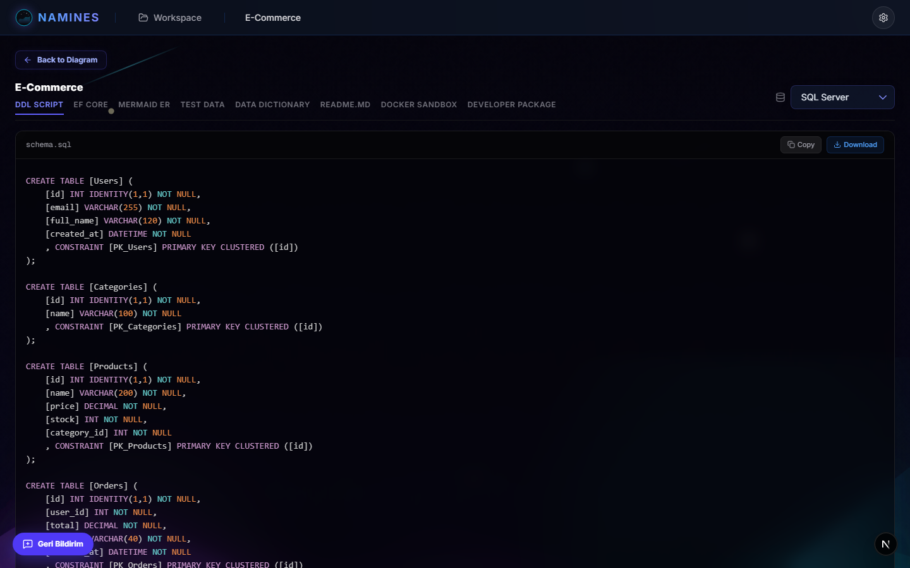
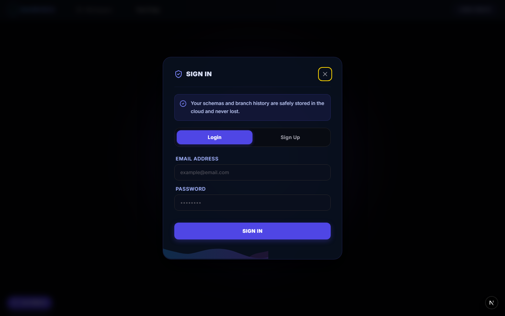

<div align="center">

# ⚡ Namines

### Design interactive database architectures in seconds — with AI.

Describe your app in plain language and Namines generates a normalized schema, renders it on an
interactive canvas, and produces production‑ready DDL, EF Core models, migrations, mock data,
documentation and more — across **six** database engines.

**English** · [Türkçe](README.tr.md)

<br/>



</div>

---

## 📑 Table of contents

- [Overview](#-overview)
- [Screenshots](#️-screenshots)
- [Features](#-features)
- [Tech stack](#-tech-stack)
- [Project structure](#️-project-structure)
- [Getting started](#-getting-started)
- [AI token model](#️-ai-token-model)
- [Security](#-security)
- [License](#-license)

## 🧭 Overview

Namines turns an idea into a working data model. Type *“an e‑commerce store with users, products,
orders and order items”* (or dictate it, or drop a screenshot of an existing ERD) and Namines:

1. Generates a **normalized 3NF schema** with primary/foreign keys and relations.
2. Renders it on an **interactive canvas** you can edit collaboratively in real time.
3. Compiles it into **DDL, EF Core, migrations, mock data, diagrams and docs** for the engine of
   your choice — and can even spin up a throwaway database in Docker.

Everything runs against a .NET 8 API with pluggable AI providers (Groq, Gemini, Ollama, or your own
key), while a Next.js front‑end delivers the canvas, panels and live collaboration.

## 🖼️ Screenshots

| Interactive canvas | DDL generation |
|---|---|
|  |  |

| Cloud sign‑in | Landing |
|---|---|
|  |  |

## ✨ Features

### AI‑powered design
- **Schema generation** from natural language, a **reference URL**, or an **image** (vision).
- **Voice input** — dictate your prompt (Whisper).
- **AI DBA advisor** — a schema health score with prioritized, explained issues.
- **Smart Seed** — domain‑aware mock/test data.
- **Reverse engineering** — turn an existing `DbContext` back into a visual schema.

### Visual workspace
- **Interactive canvas** (React Flow) — drag‑and‑drop tables, columns and relations.
- **⌘K command palette** — jump to any action from the keyboard.
- **Undo / Redo** — Ctrl+Z / Ctrl+Shift+Z with a 50‑snapshot history stack.
- **Canvas search** — Ctrl+F to find and zoom to any table or column.
- **Schema templates** — 5 pre‑built starter schemas (e‑commerce, SaaS, CRM, blog, healthcare); merge into or replace the current schema.
- **Real‑time collaboration** — shareable rooms with live cursors and schema sync (SignalR).
- **Version control** — branches and a per‑workspace migration baseline.

### Compilation & export
- **Multi‑engine DDL** — SQL Server, PostgreSQL, MySQL, MariaDB, SQLite, Oracle.
- **EF Core** models & a guided **migration wizard** (diff + preview).
- **Prisma schema export** — generate a ready‑to‑use `.prisma` file with relations and type mapping.
- **SQL DDL import** — paste or upload a `.sql` file; `CREATE TABLE`, `ALTER TABLE ADD/DROP COLUMN`, and `ALTER TABLE ADD FOREIGN KEY` are all parsed.
- **In‑browser SQL console** — run the generated DDL locally via SQLite (WASM).
- **Docker sandbox** — provision a throwaway DB container and download a backup
  (`.bak` for SQL Server, `.sql` dump for PostgreSQL/MySQL).
- **Developer package** — export a ready‑to‑run Streamlit admin app (ZIP).
- **Docs & diagrams** — Data Dictionary PDF, README.md, Mermaid ER/class/flow (TR/EN).

### CI / Developer tooling
- **Schema diff** (`scripts/namines-diff.mjs`) — dependency‑free Markdown diff report between two schema JSON files; detects added/dropped tables, columns, and **relations**; exits 2 on destructive changes so CI can gate merges.

### Platform
- **Accounts & cloud sync** — JWT over an httpOnly cookie; projects saved to the cloud
  (branches are kept locally, per device).
- **Fair AI usage** — a shared daily token pool with a per‑user cap; on exhaustion, supported
  features fall back to a free local engine instead of blocking.
- **Pro plan** — optional paid tier via Stripe Hosted Checkout (price configured in Stripe).
- **Feedback widget** — built‑in bug/idea reporting (homepage only, English).

## 🧱 Tech stack

| Layer | Stack |
|---|---|
| Frontend | Next.js 16, React 19, TypeScript, Zustand, React Flow, Tailwind CSS |
| Backend | .NET 8, ASP.NET Core, EF Core (PostgreSQL), SignalR (Redis backplane), Serilog |
| AI | Groq (Llama 3.3 70B / GPT‑OSS 120B / Llama 4 Scout), Google Gemini, Ollama, OpenAI (BYOK), Whisper |
| Infra | Docker / docker‑compose, Stripe |

## 🗂️ Project structure

```
backend/
  Namines.API/            ASP.NET Core Web API (controllers, middleware, SignalR hub)
  Namines.Core/           Domain models, prompt builders, interfaces
  Namines.Infrastructure/ AI services, DDL generators, EF Core, data access
frontend/                 Next.js app (canvas, compile, panels, stores, hooks)
docker-compose.yml        Backend + frontend containers
```

## 🚀 Getting started

### Prerequisites
- [.NET 8 SDK](https://dotnet.microsoft.com/) and [Node.js 20+](https://nodejs.org/)
- A free [Groq API key](https://console.groq.com/keys)
- (Optional) Docker Desktop — only needed for the Docker sandbox feature

### 1. Configure secrets
All secrets live in a single **git‑ignored** `.env` at the repo root:

```bash
cp .env.example .env
```

Fill in at least `Jwt__Key` (32+ chars) and `Groq__ApiKey`. The `__` separator maps to .NET config
(`Jwt__Key` → `Jwt:Key`); the backend auto‑loads `.env` on startup.

### 2. Run the backend
```bash
cd backend/Namines.API
dotnet run
# → http://localhost:5000   (Swagger at /swagger)
```

### 3. Run the frontend
```bash
cd frontend
npm install
npm run dev
# → http://localhost:3000
```

### …or with Docker
```bash
docker compose up --build
```

## 🚢 Deploying

Production uses **separate** env files — not the local `.env`:

| Target | Template | Notes |
|---|---|---|
| Backend (Railway / Render / Fly / VPS) | [`deploy/backend.env.example`](deploy/backend.env.example) | `Jwt__Key`, `Groq__ApiKey`, `App__FrontendUrl` are required |
| Frontend (Vercel) | [`deploy/frontend.env.example`](deploy/frontend.env.example) | Only `NEXT_PUBLIC_API_URL` — baked in at **build** time |

Three settings decide whether a deploy works:

1. **`App__FrontendUrl`** must equal the frontend's exact origin — in Production, localhost is not
   auto‑allowed, so a wrong value blocks every browser request via CORS.
2. **`Auth__CrossSiteCookie=true`** when frontend and API are on *different* sites (e.g. Vercel +
   Railway). Otherwise the browser drops the auth cookie and login silently never sticks.
3. **`NEXT_PUBLIC_API_URL`** must **not** end in `/api` — the client appends it.

Control DB is PostgreSQL — use a managed provider (Neon/RDS/Azure Database) or persist
the `namines-control-db-data` volume; either way, back it up, or every account is wiped
on redeploy.

## 🎛️ AI token model

Namines meters premium AI usage against a **shared daily token pool**, so a single user can’t drain
it — without pre‑allocating tokens to dormant accounts:

- `AiPool:DailyTokenPool` — shared daily budget (default **100 000**, ≈ Groq free‑tier daily tokens).
- `AiPool:PerUserDailyTokens` — per‑user daily cap (default **20 000**).
- Consumption is charged **on demand**; when the pool **or** a user’s cap is exhausted, supported
  features (docs, mock data, dev package, reverse engineering) transparently **fall back to the
  free local engine** rather than erroring out.

Raise the pool at any time (e.g. to `1000000`) in `appsettings.json` — no code changes needed.

## 🔐 Security

- Secrets are never committed — a single git‑ignored `.env` is the source of truth.
- JWT is stored in an **httpOnly cookie** (not `localStorage`), mitigating token theft via XSS.
- BYOK API keys are encrypted at rest with **AES‑256‑GCM** (non‑extractable Web Crypto key).
- **SSRF guards** on server‑side URL fetching and DB connection targets, **rate limiting** on
  sensitive endpoints, and **prompt‑injection hardening** on AI prompts.

## 📄 License

Released under the [MIT License](LICENSE).
