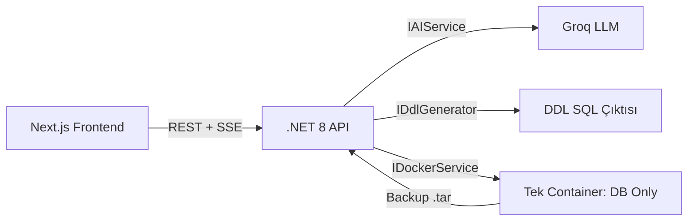
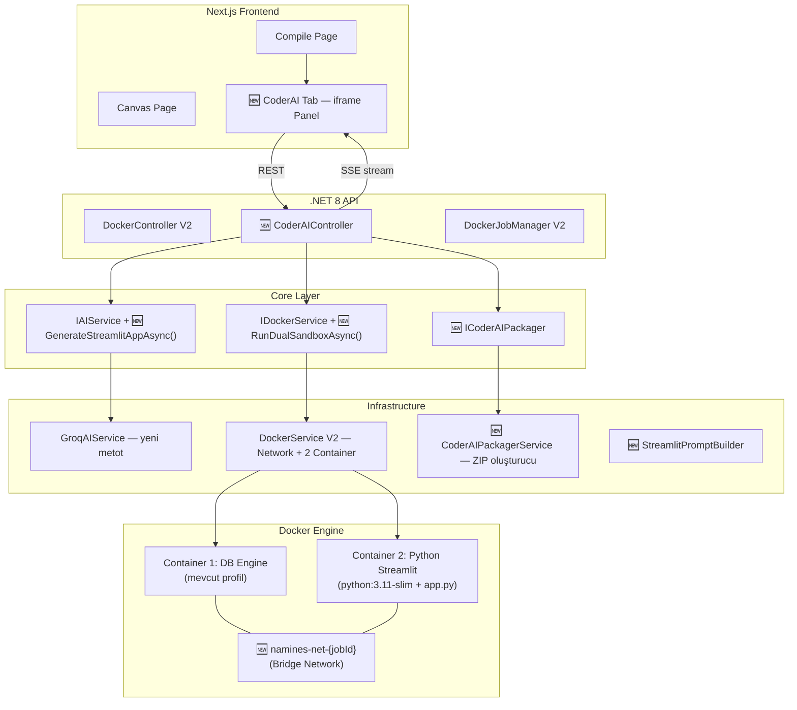

# FAZ 6: CoderAI — Mimari Plan & Yol Haritası

> **Tarih:** 16 Mayıs 2026  
> **Proje:** Namines V2 → V3 (CoderAI Entegrasyonu)  
> **Hedef:** Kullanıcının AI ile tasarladığı veritabanı şemasından, otonom olarak çalışan bir Python Streamlit Admin Panel + Dashboard üretmek ve bunu Docker Sandbox V2 ile canlı test ettirmek.

---

## 1. Mevcut Mimari Analizi (AS-IS)



| Katman | Mevcut Durum |
|--------|-------------|
| **Core/Interfaces** | `IAIService` (4 metot), `IDockerService` (1 metot), `IDdlGenerator`, `IDocumentationGenerator` |
| **Infrastructure/AI** | `GroqAIService` — Schema, Revise, MockData, Summary |
| **Infrastructure/Services** | `DockerService` — Tek container oluştur → SQL çalıştır → Backup al → Sil |
| **API/Controllers** | `DockerController` — `POST run`, `GET stream/{jobId}`, `GET download/{jobId}` |
| **API/Services** | `DockerJobManager` — In-memory job tracking + SSE event'leri |
| **Frontend** | Canvas → Compile sayfası → Docker Progress Modal |

### Kritik Kısıtlar
- `DockerService` şu an **tek container** yaratıp, iş bitince **siliyor**. CoderAI'da container'lar kullanıcı test ederken **canlı kalmalı**.
- `IAIService` sadece JSON şema çıktısı üretiyor. CoderAI'da **Python kaynak kodu** (string) üretmesi gerekecek.
- Frontend'de **iframe embed** altyapısı yok; compile sayfasına yeni bir sekme + modal gerekecek.

---

## 2. Hedef Mimari (TO-BE)



---

## 3. Sistem Mimarisi Değişiklikleri (Detaylı)

### 3.1 Core Layer Değişiklikleri

#### `IAIService.cs` — Yeni Metot
```
+ Task<string> GenerateStreamlitAppAsync(DatabaseSchema schema, DatabaseType dbType);
```
- **Girdi:** Tam `DatabaseSchema` JSON + hedef DB tipi
- **Çıktı:** Çalışır durumda tek dosya `app.py` kaynak kodu (string)
- Mevcut 4 metoda dokunulmaz, sadece yeni metot eklenir

#### `IDockerService.cs` — Yeni Metot
```
+ Task<DualSandboxResult> RunDualSandboxAsync(
      string jobId,
      string sqlContent,
      string appPyContent,
      DatabaseType dbType,
      Action<string> onProgress);
```
- **Dönüş Tipi (Yeni Model):**
```
DualSandboxResult {
    string DbContainerId;
    string AppContainerId;
    string NetworkId;
    int StreamlitPort;        // Dışarıya map'lenen port (8501+offset)
    string StreamlitUrl;      // http://localhost:{port}
}
```

> [!IMPORTANT]
> Mevcut `RunSandboxAndBackupAsync` metodu KORUNMALI. Compile sayfasındaki "DB Push" akışı bozulmamalı. Yeni metot tamamen ayrı bir pipeline.

#### `ICoderAIPackager.cs` — Yeni Interface
```
Task<string> PackageAsZipAsync(
    string appPyContent,
    string sqlContent,
    DatabaseType dbType,
    string projectName);
// Dönüş: ZIP dosyasının disk yolu
```

### 3.2 Infrastructure Layer Değişiklikleri

#### `GroqAIService.cs` — `GenerateStreamlitAppAsync` Implementasyonu
- Yeni bir `StreamlitPromptBuilder` kullanacak (aşağıda detaylı)
- AI'dan dönen çıktı ```` ```python ... ``` ```` ile sarılı gelecek → temizleme (mevcut markdown strip mantığı ile aynı)
- **Retry mekanizması:** Mevcut `maxRetries = 2` pattern'i aynen kullanılacak
- **Validasyon:** Dönen kodun `import streamlit` içerip içermediği kontrol edilecek (basit string check)

#### `DockerService.cs` — Dual Container Orkestrasyonu

**Akış sırası:**

| Adım | İşlem | SSE Mesajı |
|------|-------|-----------|
| 1 | Docker Network oluştur (`namines-net-{jobId}`) | "Özel ağ oluşturuluyor..." |
| 2 | DB Container'ı oluştur + network'e bağla | "Veritabanı başlatılıyor..." |
| 3 | DB Container başlat + 15s warmup | "Sağlık kontrolü bekleniyor..." |
| 4 | SQL script'i DB'ye aktar + çalıştır | "DDL script çalıştırıldı." |
| 5 | `app.py` + `requirements.txt` içeren geçici dizin oluştur | "Streamlit uygulaması hazırlanıyor..." |
| 6 | Python Container'ı oluştur (bind mount veya COPY) + network'e bağla | "Admin panel başlatılıyor..." |
| 7 | Python Container başlat, port 8501→random host port map | "Streamlit aktif!" |
| 8 | `StreamlitUrl` döndür | `STREAMLIT_URL\|http://localhost:{port}` |

**Cleanup stratejisi:** Container'lar hemen SİLİNMEZ. Kullanıcı testi bitirdiğinde frontend'den `DELETE /api/coderai/sandbox/{jobId}` çağrılır.

**Timeout:** 10 dakika sonra otomatik temizleme (background timer veya `CancellationTokenSource`).

#### Docker Network & Service Discovery

```
Container 1 (DB):     hostname = "db", network = namines-net-{jobId}
Container 2 (Python): hostname = "app", network = namines-net-{jobId}
```

Python `app.py` içinde connection string:
- PostgreSQL: `postgresql://postgres:Namines_Secure123!@db:5432/naminesdb`
- MySQL: `mysql+pymysql://root:Namines_Secure123!@db:3306/naminesdb`
- MSSQL: `mssql+pyodbc://sa:Namines_Secure123!@db:1433/naminesdb?driver=ODBC+Driver+17+for+SQL+Server`

> [!NOTE]
> Hostname `db` kullanılacak çünkü aynı Docker network içinde container adları DNS olarak çözülür. Port mapping'e gerek yok — internal port yeterli.

#### `CoderAIPackagerService.cs` — ZIP Oluşturucu

ZIP içeriği:

```
📦 {ProjectName}-admin-panel.zip
├── app.py                    # AI-generated Streamlit app
├── requirements.txt          # streamlit, sqlalchemy, plotly, pymssql/psycopg2/pymysql
├── docker-compose.yml        # DB + Streamlit iki servis tanımı
├── .env                      # Connection credentials
└── README.md                 # Kurulum talimatları (auto-generated)
```

### 3.3 API Layer Değişiklikleri

#### `CoderAIController.cs` — Yeni Controller

| Endpoint | Method | Açıklama |
|----------|--------|----------|
| `/api/coderai/generate` | POST | Schema + DbType alır → AI'dan app.py üretir → sandbox başlatır → jobId döner |
| `/api/coderai/stream/{jobId}` | GET (SSE) | Sandbox ilerleme logları + `STREAMLIT_URL` event'i |
| `/api/coderai/download/{jobId}` | GET | Paketlenmiş ZIP dosyasını indirir |
| `/api/coderai/sandbox/{jobId}` | DELETE | Container'ları ve network'ü temizler |
| `/api/coderai/status/{jobId}` | GET | Container durumlarını sorgular (running/stopped) |

### 3.4 Frontend Değişiklikleri

#### Compile Sayfası — Yeni "Admin Panel (AI)" Sekmesi

Mevcut `activeTab` state'ine `'ADMIN'` eklenir:
```
type TabType = 'SQL' | 'EF' | 'ER' | 'MOCK' | 'ADMIN';
```

#### `StreamlitPreviewPanel.tsx` — Yeni Bileşen

- Kullanıcı "Admin Panel (AI)" sekmesine tıkladığında:
  1. "🚀 Admin Paneli Oluştur" butonu gösterilir (Premium Deep temasında)
  2. Butona basınca `POST /api/coderai/generate` çağrılır
  3. SSE stream dinlenir (mevcut `useDockerJob` hook'u genişletilir veya yeni `useCoderAIJob` hook'u yazılır)
  4. `STREAMLIT_URL` event'i geldiğinde → `<iframe>` render edilir
  5. iframe panelin üstünde: "App'i İndir (.zip)" butonu

#### iframe Güvenlik & Stil
```html
<iframe
  src={streamlitUrl}
  sandbox="allow-scripts allow-forms allow-same-origin"
  className="w-full h-full rounded-xl border border-indigo-500/20"
  style={{ minHeight: '600px' }}
/>
```

---

## 4. Prompt Engineering Stratejisi

### 4.1 System Prompt — `StreamlitPromptBuilder.cs`

Prompt'un temel yapısı:

```
Sen kıdemli bir Python Full-Stack geliştiricisisin.
Sana bir veritabanı şeması (JSON) ve hedef veritabanı tipi verilecek.

GÖREVİN: Bu şemaya uygun, TEK DOSYADA (app.py) çalışan bir Streamlit admin paneli yaz.

TEKNİK KURALLAR:
1. SQLAlchemy ile veritabanına bağlan. Connection string: {dbConnectionString}
2. Her tablo için CRUD (Ekle/Sil/Güncelle/Listele) sayfaları oluştur.
3. Ana sayfa (Dashboard): Tablo başına kayıt sayısı, basit bar/pie chart (plotly).
4. Streamlit sidebar navigasyonu kullan: "📊 Dashboard", ardından her tablo adı.
5. Karanlık tema: st.set_page_config(layout="wide", page_title="Admin Panel")
6. Tüm form alanları şemadaki kolon tiplerine uygun olmalı (int→number_input, varchar→text_input, date→date_input vb.)
7. FK alanları için dropdown (selectbox) kullan, ilişkili tablodan veri çek.
8. Silme işleminde onay iste (st.warning + checkbox).
9. Hata yakalama: try/except blokları ile kullanıcıya st.error() göster.
10. Koddaki tüm string'ler Türkçe olsun.

ÇIKTI:
- SADECE Python kodu çıktı ver. Açıklama, yorum veya markdown YAZMA.
- Kod ```python ile BAŞLAMALI ve ``` ile BİTMELİ.
- Tek dosya olmalı, import'lar en üstte.
```

### 4.2 User Prompt Yapısı

```
Veritabanı Şeması (JSON):
{schemaJson}

Hedef Veritabanı: {dbType}
Connection String: {connectionString}
Proje Adı: {projectName}

Toplam {tableCount} tablo ve {relationCount} ilişki var.

Bu şemaya uygun admin paneli kodunu üret.
```

### 4.3 Prompt Optimizasyon Stratejileri

| Sorun | Çözüm |
|-------|-------|
| Büyük şemalarda token limiti | Şema JSON'ını sadeleştir: `id` alanlarını kaldır, sadece tablo/kolon adları ve tipleri gönder |
| AI'ın connection string'i yanlış yazması | Connection string'i prompt'a hardcoded ver, "AYNEN KULLAN" de |
| Import eksiklikleri | Prompt'ta zorunlu import listesi ver (`streamlit`, `sqlalchemy`, `plotly.express`, `pandas`) |
| FK dropdown verisi | İlişki bilgisini prompt'ta açıkça belirt: "Tablo X'in Y kolonu, Tablo Z'nin W kolonuna FK" |
| Streamlit API uyumsuzlukları | `st.rerun()` kullan (eski `st.experimental_rerun()` değil). Prompt'ta versiyon belirt |

---

## 5. Docker Compose Şablonu (Kullanıcıya Verilecek)

```yaml
# docker-compose.yml (auto-generated by Namines CoderAI)
version: '3.8'
services:
  db:
    image: {dbImage}:{dbTag}
    environment: {dbEnvVars}
    volumes:
      - db_data:/var/lib/{dbDataPath}
    healthcheck:
      test: {healthCheckCmd}
      interval: 10s
      retries: 5

  admin:
    build: .
    ports:
      - "8501:8501"
    depends_on:
      db:
        condition: service_healthy
    environment:
      - DATABASE_URL={connectionString}

volumes:
  db_data:
```

---

## 6. Adım Adım Görev Listesi (Checklist)

### Faz 6.1 — Core & Model Katmanı (Temel)
- [ ] `Namines.Core/Models/` → `DualSandboxResult.cs` model sınıfı oluştur
- [ ] `Namines.Core/Models/` → `CoderAIRequest.cs` request model oluştur
- [ ] `Namines.Core/Interfaces/IAIService.cs` → `GenerateStreamlitAppAsync()` metot imzası ekle
- [ ] `Namines.Core/Interfaces/IDockerService.cs` → `RunDualSandboxAsync()` metot imzası ekle
- [ ] `Namines.Core/Interfaces/` → `ICoderAIPackager.cs` yeni interface oluştur
- [ ] `Namines.Core/Prompts/` → `StreamlitPromptBuilder.cs` oluştur (System + User prompt)

### Faz 6.2 — AI Kod Üretimi (Infrastructure)
- [ ] `GroqAIService.cs` → `GenerateStreamlitAppAsync()` implementasyonu
- [ ] Python kod temizleme metodu yaz (markdown strip + import validasyonu)
- [ ] Farklı `DatabaseType` için connection string mapping tablosu oluştur
- [ ] Unit test: Prompt'un doğru oluşturulduğunu verify et

### Faz 6.3 — Docker Sandbox V2 (Infrastructure)
- [ ] `DockerService.cs` → `CreateNetworkAsync()` private metot (bridge network)
- [ ] `DockerService.cs` → `CreateDbContainerAsync()` refactor (mevcut kodu ayır)
- [ ] `DockerService.cs` → `CreateStreamlitContainerAsync()` private metot
- [ ] `DockerService.cs` → `RunDualSandboxAsync()` implementasyonu (orkestrasyon)
- [ ] `DockerService.cs` → `CleanupSandboxAsync(jobId)` metot (container + network silme)
- [ ] Port çakışma önleme: Random port allocation (8501-8599 aralığı)
- [ ] Timeout mekanizması: 10dk sonra otomatik cleanup

### Faz 6.4 — ZIP Paketleyici (Infrastructure)
- [ ] `CoderAIPackagerService.cs` oluştur → `ICoderAIPackager` implementasyonu
- [ ] `requirements.txt` şablon üretici (DB tipine göre driver seçimi)
- [ ] `docker-compose.yml` şablon üretici (DB tipine göre)
- [ ] `.env` ve `README.md` şablon üretici
- [ ] `System.IO.Compression.ZipFile` ile paketleme

### Faz 6.5 — API Controller (API Layer)
- [ ] `CoderAIController.cs` oluştur — 5 endpoint
- [ ] `DockerJobManager` genişlet veya `CoderAIJobManager` oluştur (sandbox state tracking)
- [ ] `Program.cs` → yeni DI kayıtları (`ICoderAIPackager`, controller)
- [ ] SSE stream endpoint'i (mevcut pattern'i takip et)
- [ ] CORS ayarları: iframe için gerekli header'lar

### Faz 6.6 — Frontend Entegrasyonu (Next.js)
- [ ] `services/api.ts` → `coderAIService` endpoint'leri ekle
- [ ] `hooks/useCoderAIJob.ts` → SSE dinleyici hook oluştur
- [ ] Compile sayfası → `'ADMIN'` tab ekle
- [ ] `components/compile/StreamlitPreviewPanel.tsx` → iframe + kontrol butonları
- [ ] "Admin Paneli Oluştur" butonu (Premium Deep temasında, yıldız efektli)
- [ ] "App'i İndir (.zip)" butonu
- [ ] "Sandbox'ı Kapat" butonu (cleanup endpoint'i çağırır)
- [ ] iframe yükleme durumu: skeleton/spinner göster

### Faz 6.7 — Test & Polish
- [ ] E2E test: PostgreSQL şeması → app.py üretimi → dual container → iframe embed
- [ ] E2E test: MySQL ve MSSQL ile aynı akış
- [ ] Büyük şema testi (10+ tablo)
- [ ] Timeout/cleanup mekanizmasını doğrula
- [ ] ZIP indirme ve lokal `docker-compose up` ile çalıştığını doğrula
- [ ] iframe iframe-içi navigasyon testi

---

## 7. Risk Analizi & Mitigasyon

| Risk | Etki | Olasılık | Mitigasyon |
|------|------|----------|-----------|
| AI'ın hatalı Python kodu üretmesi | Yüksek | Orta | Retry mekanizması + syntax check (`py_compile` container içinde) |
| Token limiti aşımı (büyük şemalar) | Orta | Düşük | Şema sadeleştirme + `llama-3.3-70b` (128K context) |
| Port çakışması | Düşük | Düşük | Random port + retry |
| Container sızıntısı (temizlenmeyen) | Orta | Orta | Background timer + `namines-` prefix ile toplu temizleme |
| MSSQL container'da ODBC driver eksik | Yüksek | Yüksek | Custom Dockerfile: `python:3.11-slim` + `msodbcsql17` |
| iframe CSP/CORS engeli | Orta | Düşük | Streamlit `--server.enableCORS=false --server.enableXsrfProtection=false` |

---

## 8. Tahmini Efor & Öncelik Sırası

| Faz | Efor | Öncelik | Bağımlılık |
|-----|------|---------|-----------|
| 6.1 Core & Model | ~1 saat | P0 | Yok |
| 6.2 AI Kod Üretimi | ~2 saat | P0 | 6.1 |
| 6.3 Docker Sandbox V2 | ~3-4 saat | P0 | 6.1 |
| 6.4 ZIP Paketleyici | ~1 saat | P1 | 6.2 |
| 6.5 API Controller | ~2 saat | P0 | 6.2 + 6.3 |
| 6.6 Frontend | ~3 saat | P0 | 6.5 |
| 6.7 Test & Polish | ~2 saat | P1 | Hepsi |

**Toplam tahmini efor: ~14-16 saat**

> [!TIP]
> Önerilen başlangıç sırası: **6.1 → 6.2 → 6.3 → 6.5 → 6.6 → 6.4 → 6.7**
> ZIP paketleyici (6.4) sonraya bırakılabilir; önce canlı sandbox deneyimi çalışsın.
