# FAZ 7: DEEP IMPACT — Mimari Dönüşüm Planı

> **Belge Türü:** SRS / Mimari Tasarım Belgesi (Software Architecture Document)
> **Tarih:** 30 Mayıs 2026
> **Hazırlayan:** Darvell Labs — CTO Office
> **Proje:** Namines V3 → V4 (Deep Impact)
> **Gizlilik:** Şirket İçi — Confidential

---

## Yönetici Özeti (Executive Summary)

Bu belge, Namines projesini **basit bir CRUD şema tasarım aracından**, **Kurumsal Seviye AI Veritabanı & DevOps Platformuna** dönüştürmek için hazırlanmış kapsamlı bir mimari plandır.

Plan iki ana aşamadan oluşur:

| Aşama | Kod Adı | Hedef | Süre |
|-------|---------|-------|------|
| **Bölüm 1** | 🔧 Stabilizasyon & Refactoring | Faz 6 (CoderAI) kaynaklı regresyonları gidermek, sistemi production-ready hale getirmek | ~2-3 gün |
| **Bölüm 2** | 🚀 Deep Impact Vizyonu | 4 yeni inovasyon modülü ile platformu rakiplerinden ayıracak AI-native özellikler eklemek | ~3-4 hafta |

**Toplam Tahmini Efor:** ~120-160 saat (1 kıdemli geliştirici)

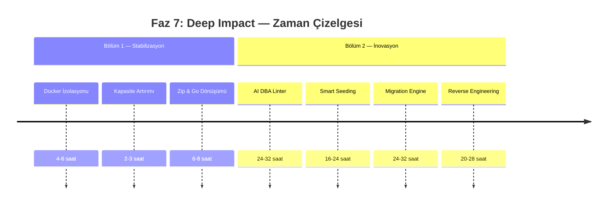

---

## İçindekiler

1. [Mevcut Mimari Analizi (AS-IS)](#1-mevcut-mimari-analizi-as-is)
2. [Hedef Mimari (TO-BE)](#2-hedef-mimari-to-be)
3. [BÖLÜM 1: Stabilizasyon & Refactoring](#3-bölüm-1-stabilizasyon--refactoring)
   - [3.1 Docker .bak İzolasyonu](#31-docker-bak-i̇zolasyonu)
   - [3.2 20+ Tablo Kapasite Artırımı](#32-20-tablo-kapasite-artırımı)
   - [3.3 Zip & Go Frontend Dönüşümü](#33-zip--go-frontend-dönüşümü)
4. [BÖLÜM 2: Deep Impact Vizyonu](#4-bölüm-2-deep-impact-vizyonu)
   - [4.1 AI DBA — Otonom Performans Danışmanı](#41-ai-dba--otonom-performans-danışmanı)
   - [4.2 Context-Aware Smart Seeding](#42-context-aware-smart-seeding)
   - [4.3 AI Migration Engine](#43-ai-migration-engine)
   - [4.4 Reverse Engineering — Beyaz Tahtadan Koda](#44-reverse-engineering--beyaz-tahtadan-koda)
5. [Küresel Risk Analizi & Mitigasyon Matrisi](#5-küresel-risk-analizi--mitigasyon-matrisi)
6. [Efor & Önceliklendirme Tablosu](#6-efor--önceliklendirme-tablosu)
7. [Bağımlılık Grafiği](#7-bağımlılık-grafiği)
8. [Sonuç & Onay](#8-sonuç--onay)

---

## 1. Mevcut Mimari Analizi (AS-IS)

### 1.1 Sistem Bileşenleri

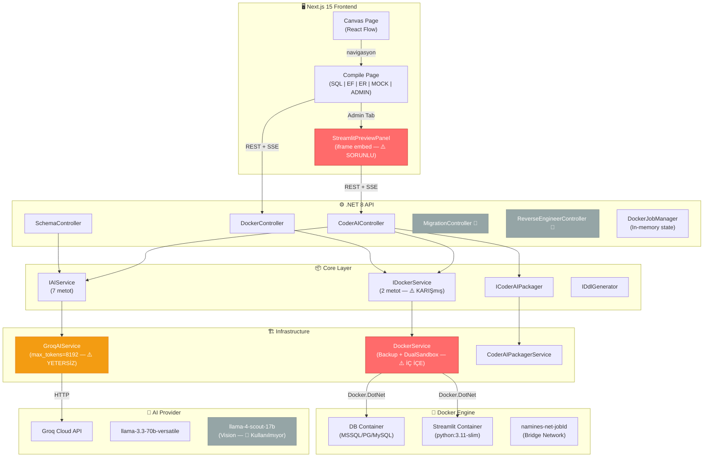

> [!WARNING]
> **Kırmızı ile işaretli bileşenler** aktif sorun kaynağıdır. **Gri bileşenler** iskelet halindedir, henüz fonksiyonel değildir.

### 1.2 Tespit Edilen Kritik Sorunlar

| # | Sorun | Etkilenen Katman | Şiddet |
|---|-------|-----------------|--------|
| **S1** | `DockerService.RunDualSandboxAsync()` implementasyonu `RunSandboxAndBackupAsync()` akışını bozuyor. Dual sandbox network/container mantığı orijinal tek-container backup akışına sızıyor. **Sonuç: .bak üretimi 500 hatası veriyor.** | Infrastructure | 🔴 Kritik |
| **S2** | `GroqAIService` içinde `max_tokens = 8192` hardcoded. 20+ tablolu şemalarda AI yanıtı yarıda kesiliyor, bozuk JSON dönüyor. | Infrastructure | 🟠 Yüksek |
| **S3** | `HttpClient` timeout süresi varsayılan (~100s). Büyük şemalarda Groq API yanıt süresi bunu aşıyor → `TaskCanceledException`. | Infrastructure | 🟠 Yüksek |
| **S4** | Compile sayfasındaki iframe tabanlı Streamlit önizleme CORS/CSP sorunları, karmaşık yaşam döngüsü yönetimi ve Docker kaynak sızıntısına neden oluyor. | Frontend + Infra | 🟡 Orta |
| **S5** | `MigrationController` ve `ReverseEngineerController` iskelet halinde — boş endpoint'ler 404/501 dönüyor. | API | 🟡 Orta |
| **S6** | Vision modeli (`llama-4-scout-17b`) `IAIService.AnalyzeImageAsync()` olarak tanımlı ama hiçbir controller'dan çağrılmıyor. | Core + API | ⚪ Düşük |

---

## 2. Hedef Mimari (TO-BE)

### 2.1 Dönüşüm Sonrası Genel Mimari

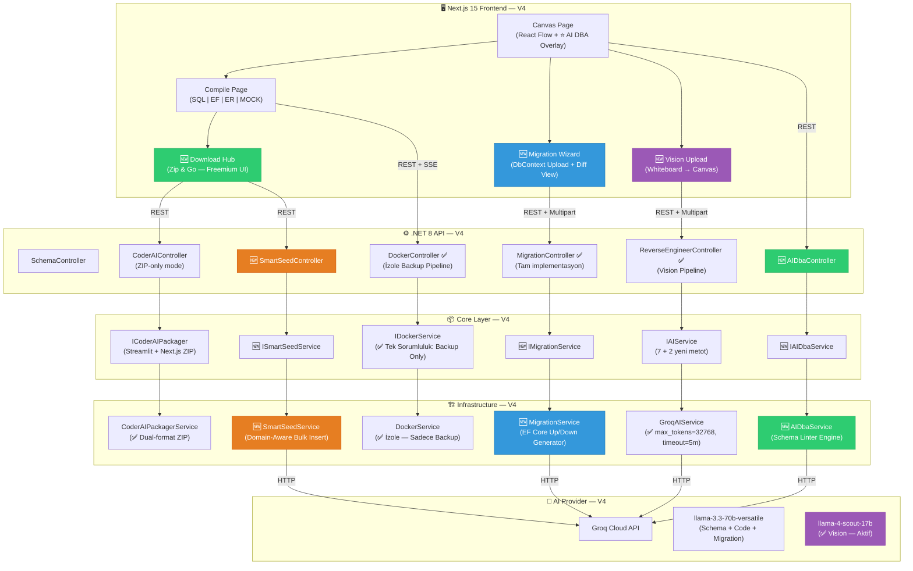

### 2.2 AS-IS vs TO-BE Karşılaştırma

| Kriter | AS-IS (V3) | TO-BE (V4 — Deep Impact) |
|--------|-----------|--------------------------|
| **DockerService** | Backup + DualSandbox iç içe → 500 hatası | Sadece Backup — tek sorumluluk |
| **AI Token Limiti** | 8192 → büyük şemalarda kesinti | 32768 + dinamik hesaplama |
| **HttpClient Timeout** | ~100s varsayılan | 5 dakika + retry policy |
| **Streamlit Önizleme** | iframe canlı embed (karmaşık) | ZIP indirme (Freemium model) |
| **Performans Analizi** | Yok | AI DBA Linter — Canvas overlay |
| **Test Verisi** | Lorem Ipsum rastgele | Domain-aware gerçekçi veri |
| **Migration** | Yok (her seferinde sıfırdan) | DbContext diff → EF Core Up/Down |
| **Reverse Engineering** | Yok | Beyaz tahta fotoğrafı → Canvas |
| **Vision AI** | Tanımlı ama kullanılmıyor | Aktif — whiteboard analizi |

---

## 3. BÖLÜM 1: Stabilizasyon & Refactoring

> [!IMPORTANT]
> Bu bölümdeki değişiklikler **Bölüm 2'den ÖNCE** tamamlanmalıdır. Stabil olmayan bir temel üzerine yeni özellik inşa etmek teknik borcu katlar.

---

### 3.1 Docker .bak İzolasyonu

#### Sorun Tanımı

Faz 6'da eklenen `RunDualSandboxAsync()` metodu, `DockerService` sınıfı içinde orijinal `RunSandboxAndBackupAsync()` ile aynı yardımcı metotları (container oluşturma, SQL çalıştırma) paylaşıyor. Dual sandbox'ın network ve çoklu container mantığı, tek-container backup akışına yan etkiler yarattı.

**Kök Neden:** Tek bir sınıfta iki farklı sorumluluk — Single Responsibility Principle (SRP) ihlali.

#### AS-IS: Bozuk Akış

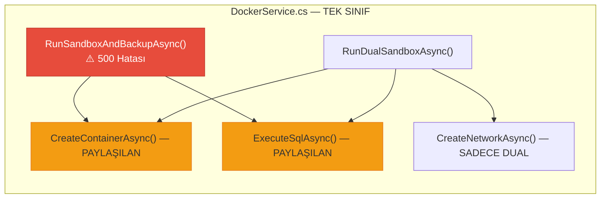

#### TO-BE: İzole Mimari

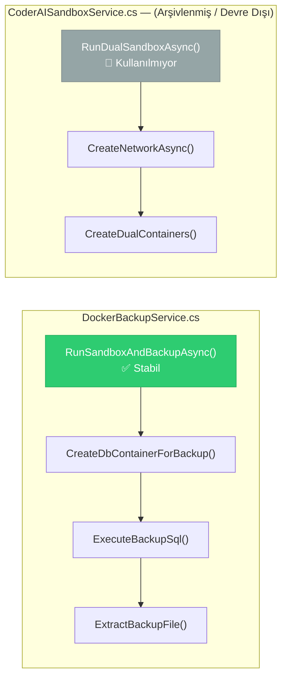

#### Teknik Checklist

**Backend (C# — Infrastructure Layer):**

- [ ] `DockerService.cs`'yi `DockerBackupService.cs` olarak yeniden adlandır
- [ ] `RunDualSandboxAsync()` ve ilgili tüm dual-sandbox metotlarını (`CreateNetworkAsync`, `CreateStreamlitContainerAsync`, vb.) bu sınıftan **tamamen kaldır**
- [ ] `DockerBackupService` sadece şu akışı içersin:
  1. `CreateContainerAsync()` — Tek DB container
  2. `WaitForHealthyAsync()` — Sağlık kontrolü
  3. `ExecuteSqlAsync()` — DDL çalıştır
  4. `ExtractBackupAsync()` — .bak/.sql dosyasını çıkart
  5. `CleanupAsync()` — Container'ı sil
- [ ] Eski dual-sandbox kodunu `CoderAISandboxService.cs` adlı ayrı bir sınıfa taşı (devre dışı, gelecekte gerekirse)
- [ ] `IDockerService.cs` interface'inden `RunDualSandboxAsync()` metot imzasını kaldır
- [ ] `Program.cs` → DI kaydını güncelle: `services.AddScoped<IDockerService, DockerBackupService>()`
- [ ] `DockerController.cs` → Sadece backup endpoint'lerini kullansın, dual sandbox referansları temizlensin

**Frontend (Next.js):**

- [ ] `useDockerJob.ts` hook'undan dual-sandbox ile ilgili state/logic'i temizle
- [ ] `DockerProgressModal` → Sadece backup akışına odaklansın

**Doğrulama Kriterleri:**

- [ ] 3 tablolu basit şema → .bak başarıyla üretilir (MSSQL)
- [ ] 3 tablolu basit şema → .sql başarıyla üretilir (PostgreSQL, MySQL)
- [ ] 10+ tablolu şema → .bak başarıyla üretilir
- [ ] Dual sandbox kodu hiçbir yerde çağrılmıyor (dead code analizi)

#### Risk & Mitigasyon

| Risk | Olasılık | Etki | Mitigasyon |
|------|----------|------|------------|
| Refactoring sırasında mevcut backup akışında yeni bug | Orta | Yüksek | Refactoring öncesi 3 farklı DB tipi için smoke test yazılıp çalıştırılmalı |
| DI kayıt hatası | Düşük | Yüksek | Uygulama başlangıcında `IDockerService` resolution test edilmeli |

**Tahmini Efor:** 4-6 saat
**Öncelik:** 🔴 P0 — Kritik

---

### 3.2 20+ Tablo Kapasite Artırımı

#### Sorun Tanımı

`GroqAIService.cs` içinde `max_tokens = 8192` olarak hardcoded. 20+ tablolu şemalarda Groq API yanıtı tam JSON üretmeden token limitine ulaşıyor ve yanıt yarıda kesiliyor. Ayrıca `HttpClient` varsayılan timeout'u (~100 saniye) büyük şemalarda Groq'un yanıt süresini karşılayamıyor.

#### AS-IS: Kısıtlı Konfigürasyon

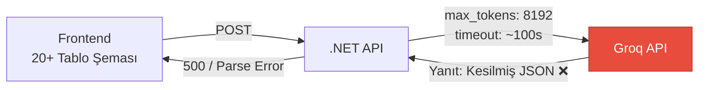

#### TO-BE: Dinamik & Esnek Konfigürasyon

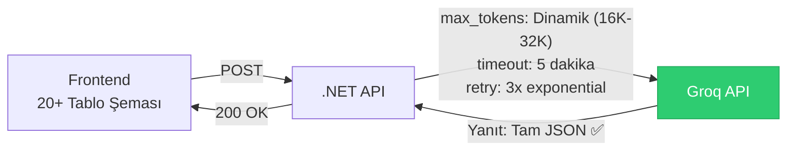

#### Teknik Checklist

**Backend (C# — Infrastructure Layer):**

- [ ] `GroqAIService.cs` → `max_tokens` değerini yapılandırılabilir yap:
  ```
  appsettings.json → "Groq": { "MaxTokens": 32768, "DefaultModel": "llama-3.3-70b-versatile" }
  ```
- [ ] Token hesaplama stratejisi ekle:
  ```
  int CalculateMaxTokens(DatabaseSchema schema)
  {
      int tableCount = schema.Tables.Count;
      if (tableCount <= 5) return 8192;
      if (tableCount <= 15) return 16384;
      return 32768; // 20+ tablo
  }
  ```
- [ ] `HttpClient` timeout süresini `Program.cs`'de konfigüre et:
  ```
  services.AddHttpClient<GroqAIService>(client => {
      client.Timeout = TimeSpan.FromMinutes(5);
  });
  ```
- [ ] Exponential backoff retry policy ekle (Polly veya manuel):
  ```
  Retry 1: 2s bekleme
  Retry 2: 4s bekleme
  Retry 3: 8s bekleme (son deneme)
  ```
- [ ] Yanıt validasyonu güçlendir:
  - JSON parse başarısız olursa → retry
  - `finish_reason: "length"` gelirse → daha yüksek `max_tokens` ile tekrar dene
- [ ] `appsettings.json` → Groq konfigürasyon section'ı ekle:
  ```json
  {
    "Groq": {
      "ApiKey": "...",
      "DefaultModel": "llama-3.3-70b-versatile",
      "VisionModel": "llama-4-scout-17b-16e-instruct",
      "MaxTokensSmall": 8192,
      "MaxTokensMedium": 16384,
      "MaxTokensLarge": 32768,
      "HttpTimeoutMinutes": 5,
      "MaxRetries": 3
    }
  }
  ```

**Frontend (Next.js):**

- [ ] API çağrılarında `fetch` timeout'unu artır (5 dakika):
  ```typescript
  const controller = new AbortController();
  const timeoutId = setTimeout(() => controller.abort(), 300000); // 5 min
  ```
- [ ] Uzun süren işlemler için kullanıcıya "Büyük şema — bu işlem biraz zaman alabilir" uyarısı göster
- [ ] Progress indicator'da tahmini süre gösterimi ekle

**Doğrulama Kriterleri:**

- [ ] 25 tablolu test şeması → Tam JSON üretilir, parse edilir
- [ ] 30+ tablolu şema → `finish_reason: "length"` durumunda otomatik retry
- [ ] 3 dakikalık yanıt süresi → timeout olmaz
- [ ] `appsettings.json` değişikliği → restart'sız etki (IOptionsMonitor)

#### Risk & Mitigasyon

| Risk | Olasılık | Etki | Mitigasyon |
|------|----------|------|------------|
| 32768 token Groq API plan limitini aşabilir | Düşük | Yüksek | Groq plan limitlerini kontrol et; gerekirse şema sadeleştirme fallback |
| 5 dakika timeout → idle connection sorunları | Düşük | Orta | Keep-alive header'ları ekle |
| Retry storm — aynı anda çok fazla retry | Düşük | Orta | Per-user rate limiting + circuit breaker |

**Tahmini Efor:** 2-3 saat
**Öncelik:** 🟠 P0 — Yüksek

---

### 3.3 'Zip & Go' Frontend Dönüşümü

#### Sorun Tanımı

Mevcut Compile sayfasındaki "Admin Panel (AI)" sekmesi, Streamlit uygulamasını canlı Docker container içinde çalıştırıp iframe ile embed etmeye çalışıyor. Bu yaklaşım:

1. **CORS/CSP sorunları** — iframe güvenlik kısıtlamaları
2. **Docker kaynak sızıntısı** — Kullanıcı sayfayı kapattığında container'lar temizlenmiyor
3. **Ölçeklenebilirlik** — Her kullanıcı için 2 Docker container çalıştırmak sürdürülemez
4. **Karmaşıklık** — Network, port mapping, health check yönetimi

#### AS-IS: iframe Karmaşası

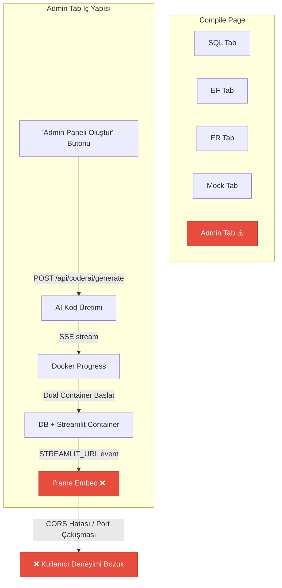

#### TO-BE: Zip & Go (Freemium Model)

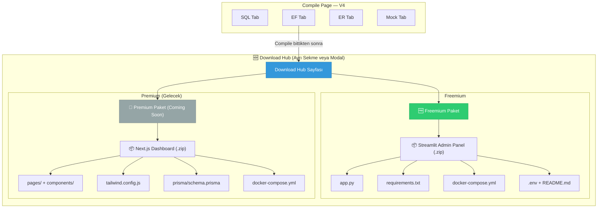

#### Teknik Checklist

**Backend (C# — API + Infrastructure):**

- [ ] `CoderAIController.cs` → iframe/sandbox endpoint'lerini kaldır veya deprecate et:
  - ~~`DELETE /api/coderai/sandbox/{jobId}`~~ → Kaldır
  - ~~`GET /api/coderai/status/{jobId}`~~ → Kaldır
  - `POST /api/coderai/generate` → ZIP üretim odaklı (container başlatmaz)
  - `GET /api/coderai/download/{jobId}` → Koru (ZIP indirme)
- [ ] `CoderAIController.generate` akışını sadeleştir:
  1. AI'dan `app.py` kodu üret
  2. `CoderAIPackagerService` ile ZIP oluştur
  3. `jobId` + indirme linki döndür (container başlatma YOK)
- [ ] `CoderAIPackagerService.cs` → Next.js şablon desteği ekle (Premium hazırlık):
  ```
  PackageStreamlitZipAsync(...)  → Mevcut
  PackageNextJsZipAsync(...)     → Yeni (şablon dosyaları ile)
  ```
- [ ] Premium Next.js ZIP şablonu oluştur:
  - `pages/index.tsx` — Dashboard
  - `pages/[table].tsx` — Dinamik CRUD sayfası
  - `components/DataTable.tsx` — Ortak tablo bileşeni
  - `prisma/schema.prisma` — AI tarafından üretilecek
  - `docker-compose.yml` — DB + Next.js
  - `.env.local` + `README.md`

**Frontend (Next.js):**

- [ ] `StreamlitPreviewPanel.tsx` → Tamamen kaldır veya `DownloadHubPanel.tsx` ile değiştir
- [ ] `useCoderAIJob.ts` hook'unu sadeleştir — iframe/sandbox state'leri kaldır
- [ ] Compile sayfasında `ADMIN` tab'ını kaldır, yerine `DOWNLOAD` tab'ı veya ayrı bir modal/overlay ekle
- [ ] `DownloadHubPanel.tsx` — Yeni bileşen:
  ```
  ┌─────────────────────────────────────────────────┐
  │  📦 Proje Paketleri                             │
  │                                                 │
  │  ┌──────────────────┐  ┌──────────────────────┐ │
  │  │  🐍 Streamlit    │  │  ⚡ Next.js Dashboard │ │
  │  │  Admin Panel     │  │  (Premium — Yakında)  │ │
  │  │                  │  │                       │ │
  │  │  • CRUD Paneli   │  │  • Modern React UI    │ │
  │  │  • Dashboard     │  │  • Prisma ORM         │ │
  │  │  • Docker Ready  │  │  • Tailwind CSS       │ │
  │  │                  │  │                       │ │
  │  │  [🆓 İndir .zip] │  │  [👑 Premium]         │ │
  │  └──────────────────┘  └──────────────────────┘ │
  └─────────────────────────────────────────────────┘
  ```
- [ ] İndirme butonu tıklandığında:
  1. Loading state → "AI kod üretiyor..." (shimmer animasyonu)
  2. `POST /api/coderai/generate` → SSE ile ilerleme
  3. Tamamlandığında → otomatik `.zip` indirme tetikle
- [ ] Premium kartında "Coming Soon" badge + email bekleme listesi (opsiyonel)
- [ ] Responsive tasarım: Mobilde kartlar alt alta, desktop'ta yan yana

**Doğrulama Kriterleri:**

- [ ] iframe kodları codebase'den tamamen temizlenmiş
- [ ] Streamlit ZIP indirme → Lokal `docker-compose up` ile çalışıyor
- [ ] Premium kartı "Coming Soon" gösteriyor, tıklanamıyor
- [ ] Docker container sızıntısı sıfır (container başlatılmıyor)

#### Risk & Mitigasyon

| Risk | Olasılık | Etki | Mitigasyon |
|------|----------|------|------------|
| Kullanıcılar canlı önizleme özelliğini kaybettiğini hissedebilir | Orta | Orta | ZIP içindeki README'de `docker-compose up` ile 30 saniyede çalıştırma talimatı; gelecekte web-based sandbox (Bölüm 2+ plan) |
| Premium Next.js şablonunun kalitesi düşük olabilir | Düşük | Düşük | İlk aşamada sadece UI hazırlığı; asıl şablon geliştirme Premium lansmanı öncesinde |

**Tahmini Efor:** 6-8 saat
**Öncelik:** 🟡 P1 — Orta

---

## 4. BÖLÜM 2: Deep Impact Vizyonu

> [!NOTE]
> Bu bölümdeki modüller Bölüm 1 tamamlandıktan sonra, bağımsız olarak geliştirilebilir. Her modül kendi içinde kapalıdır (self-contained) ve birbirini bloklamaz.

### Modüller Arası Bağımlılık Haritası

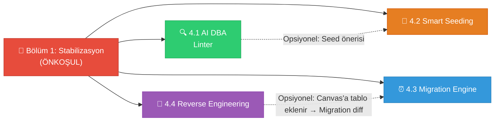

---

### 4.1 AI DBA — Otonom Performans Danışmanı

#### Vizyon

Canvas üzerindeki veritabanı şemasını gerçek zamanlı analiz eden, performans darboğazlarını ve tasarım anti-pattern'lerini tespit edip kullanıcıya React Flow node'ları üzerinde sarı ünlem (⚠️) overlay'leri ile bildiren bir **Schema Linter** motoru.

#### Mimari Akış

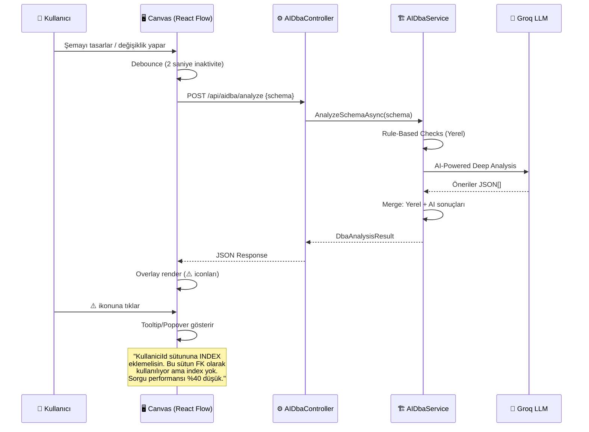

#### Linter Kuralları (Hibrit: Yerel + AI)

**Katman 1 — Yerel Kurallar (Sıfır Gecikme, AI Gerektirmez):**

| Kural ID | Kural | Şiddet | Açıklama |
|----------|-------|--------|----------|
| `DBA-001` | FK sütununda INDEX eksik | ⚠️ Warning | FK hedef sütunları otomatik index almaz (MSSQL/PG) |
| `DBA-002` | `NVARCHAR(MAX)` / `TEXT` kullanımı | ⚠️ Warning | Ölçülebilir uzunluk öner (255, 500, 1000) |
| `DBA-003` | Tablo PK yok | 🔴 Error | Her tablo bir PK'ya sahip olmalı |
| `DBA-004` | Circular FK ilişki | 🔴 Error | A→B→C→A döngüsel bağımlılık |
| `DBA-005` | Tablo adı çoğul değil | 💡 Info | Konvansiyon: `User` → `Users` |
| `DBA-006` | Sütun isimlendirme tutarsızlığı | 💡 Info | Karışık: `user_id` + `userId` |
| `DBA-007` | Cascade Delete zinciri | ⚠️ Warning | 3+ seviye cascade tehlikeli |
| `DBA-008` | Nullable FK | 💡 Info | İlişki opsiyonel mi, emin misiniz? |
| `DBA-009` | Unique constraint eksik | 💡 Info | `Email`, `Username` gibi alanlar genelde unique olmalı |
| `DBA-010` | Büyük tablo partition önerisi | 💡 Info | 5+ sütunlu, yüksek hacim tahmini tablolar |

**Katman 2 — AI Destekli Derin Analiz (Groq LLM):**

AI'a şema gönderilerek domain-spesifik öneriler alınır. Örneğin:
- "Bu bir e-ticaret şeması. `Siparisler` tablosuna `OlustrulmaTarihi` üzerinde bir clustered index + `DurumKodu` üzerinde filtered index eklemelisin."
- "Lojistik domain'inde `Seferler` tablosuna `KalkisSaati` + `VarisSaati` üzerinde composite index öner."

#### Teknik Checklist

**Backend (C#):**

- [ ] `Namines.Core/Interfaces/` → `IAIDbaService.cs` oluştur:
  ```csharp
  public interface IAIDbaService
  {
      Task<DbaAnalysisResult> AnalyzeSchemaAsync(DatabaseSchema schema, DatabaseType dbType);
  }
  ```
- [ ] `Namines.Core/Models/` → Yeni modeller:
  ```csharp
  public class DbaAnalysisResult
  {
      public List<DbaIssue> Issues { get; set; }
      public int TotalScore { get; set; }        // 0-100 sağlık puanı
      public string OverallAssessment { get; set; }
  }

  public class DbaIssue
  {
      public string RuleId { get; set; }          // "DBA-001"
      public string TableName { get; set; }
      public string? ColumnName { get; set; }
      public DbaIssueSeverity Severity { get; set; }  // Error, Warning, Info
      public string Message { get; set; }
      public string? Suggestion { get; set; }
      public string Source { get; set; }           // "Local" veya "AI"
  }
  ```
- [ ] `Namines.Infrastructure/Services/` → `AIDbaService.cs`:
  - `RunLocalRules(schema)` → 10 yerel kural kontrolü
  - `RunAIAnalysis(schema)` → Groq'a özel DBA prompt'u gönder
  - Sonuçları birleştir, puanla, dön
- [ ] `Namines.Infrastructure/Prompts/` → `DbaPromptBuilder.cs`:
  ```
  Sen kıdemli bir Veritabanı Yöneticisi (DBA) ve Performans Uzmanısın.
  Sana bir veritabanı şeması (JSON) verilecek.
  Şemayı analiz et ve performans, güvenlik, tasarım açısından iyileştirme önerileri sun.
  Her öneri için: tableName, columnName (varsa), severity (error/warning/info), message, suggestion JSON formatında dön.
  ```
- [ ] `Namines.API/Controllers/` → `AIDbaController.cs`:
  ```
  POST /api/aidba/analyze   → Schema alır, analiz sonucu döner
  ```
- [ ] `Program.cs` → DI kaydı ekle

**Frontend (Next.js — React Flow):**

- [ ] `services/api.ts` → `aiDbaService.analyze(schema)` endpoint ekle
- [ ] `hooks/useAIDba.ts` → Debounced analiz hook:
  ```typescript
  // Kullanıcı şemayı değiştirdikten 2s sonra otomatik tetikle
  const { issues, score, isAnalyzing } = useAIDba(schema, dbType);
  ```
- [ ] `components/canvas/DbaOverlay.tsx` → React Flow Custom Node Overlay:
  - Her tablo node'u üzerinde sağ üst köşede issue sayısı badge'i
  - Badge rengi: Kırmızı (error var), Sarı (warning var), Yeşil (sorun yok)
  - Tıklandığında popover açılır, issue listesi gösterilir
- [ ] `components/canvas/DbaScoreBar.tsx` → Canvas üstünde genel sağlık çubuğu:
  ```
  ┌─────────────────────────────────────────────┐
  │  🏥 Şema Sağlığı: ████████░░ 78/100        │
  │  ⚠️ 3 Uyarı  🔴 1 Hata  💡 5 Öneri         │
  └─────────────────────────────────────────────┘
  ```
- [ ] `components/canvas/DbaIssuePanel.tsx` → Sağ tarafta açılır panel:
  - Issue listesi, filtreleme (Error/Warning/Info)
  - Her issue tıklanabilir → ilgili tablo node'una zoom & highlight
  - "Otomatik Düzelt" butonu (AI önerisini uygular — gelecek faz)
- [ ] Canvas'ta animasyon: Yeni issue tespit edildiğinde node'da kısa pulse efekti

**AI (Groq):**

- [ ] DBA analiz prompt'u optimize et — few-shot örnekler ekle
- [ ] Yanıt formatını JSON Schema ile kısıtla
- [ ] Analiz cache mekanizması: Aynı şema hash'i → cache'ten dön (5 dk TTL)

#### Risk & Mitigasyon

| Risk | Olasılık | Etki | Mitigasyon |
|------|----------|------|------------|
| AI'ın yanlış pozitif öneriler vermesi | Orta | Orta | Yerel kurallar öncelikli; AI önerileri "AI Önerisi" badge'i ile etiketlensin |
| Her şema değişikliğinde API bombardımanı | Yüksek | Orta | 2s debounce + cache + rate limiting |
| React Flow performans kaybı (çok overlay) | Düşük | Orta | Overlay'leri React.memo ile sarma; 50+ issue'da sayfalama |
| Groq API rate limit | Düşük | Yüksek | Yerel kurallar her zaman çalışır (fallback); AI kısmı opsiyonel |

**Tahmini Efor:** 24-32 saat
**Öncelik:** 🟢 P1 — Yüksek (Kullanıcı değeri çok yüksek, bağımsız geliştirilebilir)

---

### 4.2 Context-Aware Smart Seeding

#### Vizyon

"Lorem Ipsum" yerine, kullanıcının tasarladığı veritabanının domain'ine özel **gerçekçi, tutarlı test verisi** üreten bir AI motoru. Çıktı olarak direkt çalıştırılabilir **Bulk Insert SQL script'i** üretir.

**Örnekler:**

| Domain (Otomatik Tespit) | Örnek Üretim |
|--------------------------|-------------|
| 🚌 Lojistik / Ulaşım | Bursa-Sakarya arası gerçekçi otobüs sefer saatleri, fiyatlar, koltuk numaraları |
| 🏥 Sağlık | Hasta adları, TC kimlik formatında ID'ler, poliklinik randevu saatleri |
| 🛒 E-Ticaret | Türkçe ürün adları, KDV hesaplı fiyatlar, cargo tracking numaraları |
| 🎓 Eğitim | Ders programı, not ortalamaları, öğrenci numaraları (8 haneli format) |
| 🏦 Finans | IBAN formatında hesap numaraları, TL/USD kur bilgileri, işlem tarihleri |

#### Mimari Akış

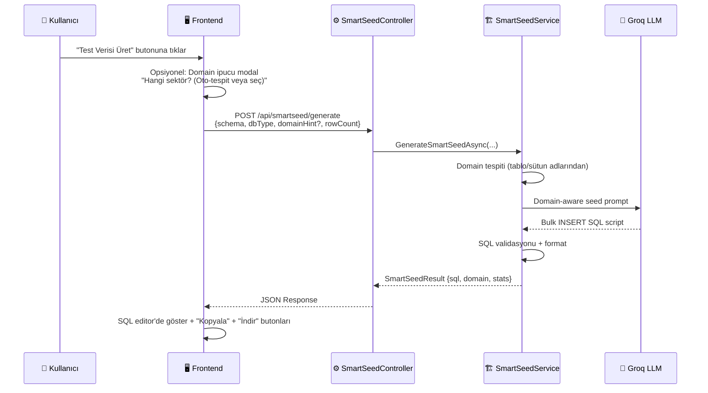

#### Domain Tespit Algoritması

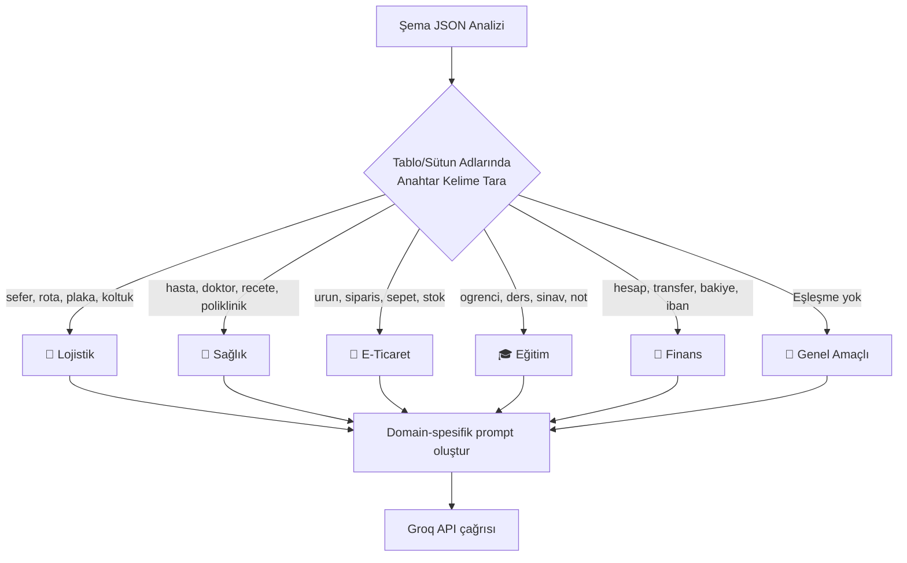

#### Teknik Checklist

**Backend (C#):**

- [ ] `Namines.Core/Interfaces/` → `ISmartSeedService.cs`:
  ```csharp
  public interface ISmartSeedService
  {
      Task<SmartSeedResult> GenerateSmartSeedAsync(
          DatabaseSchema schema,
          DatabaseType dbType,
          string? domainHint,
          int rowCount = 50);
  }
  ```
- [ ] `Namines.Core/Models/` → Yeni modeller:
  ```csharp
  public class SmartSeedResult
  {
      public string SqlScript { get; set; }
      public string DetectedDomain { get; set; }
      public Dictionary<string, int> TableRowCounts { get; set; }
      public long EstimatedSizeBytes { get; set; }
  }
  ```
- [ ] `Namines.Infrastructure/Services/` → `SmartSeedService.cs`:
  - `DetectDomain(schema)` → Anahtar kelime tabanlı domain tespiti
  - `BuildSeedPrompt(schema, domain, dbType, rowCount)` → Domain-aware prompt
  - FK tutarlılığı için insert sıralaması: Bağımsız tablolar → FK bağımlı tablolar
- [ ] `Namines.Infrastructure/Prompts/` → `SmartSeedPromptBuilder.cs`:
  ```
  Sen Türkiye'de yaşayan bir veri mühendisisin.
  Sana {domain} domain'inde bir veritabanı şeması verilecek.
  Her tablo için {rowCount} adet GERÇEKÇE ve TÜRKİYE'YE UYGUN test verisi üret.
  
  KRİTİK KURALLAR:
  1. İsimler GERÇEK Türk isimleri olsun (Ahmet Yılmaz, Elif Demir vb.)
  2. Şehirler GERÇEK Türkiye şehirleri olsun
  3. Fiyatlar TL cinsinden, KDV dahil gerçekçi olsun
  4. Tarihler 2024-2026 aralığında olsun
  5. FK değerleri TUTARLI olsun (var olan ID'lere referans ver)
  6. INSERT sıralaması FK bağımlılıklarına göre olsun (parent → child)
  7. SQL syntax'ı {dbType} için doğru olsun
  
  ÇIKTI: Sadece SQL INSERT statement'ları. Açıklama yazma.
  ```
- [ ] `Namines.API/Controllers/` → `SmartSeedController.cs`:
  ```
  POST /api/smartseed/generate   → Seed SQL üret
  POST /api/smartseed/preview    → İlk 5 satır önizleme (hızlı)
  ```
- [ ] Domain tespit sözlüğü (`DomainKeywords.cs`):
  - Türkçe + İngilizce anahtar kelime setleri
  - Ağırlık puanı sistemi (birden fazla domain eşleşirse en yüksek puan kazanır)

**Frontend (Next.js):**

- [ ] Compile sayfası → MOCK tab'ını güncelle veya yeni "Smart Seed" bölümü ekle
- [ ] `components/compile/SmartSeedPanel.tsx`:
  - Domain seçici (opsiyonel — dropdown veya auto-detect badge)
  - Satır sayısı slider (10 / 25 / 50 / 100 / 250)
  - "Akıllı Veri Üret" butonu
  - Sonuç: Syntax-highlighted SQL editor (read-only)
  - "📋 Kopyala" + "💾 SQL İndir" butonları
  - Üretilen verinin istatistikleri: "5 tablo, 250 satır, ~45KB"
- [ ] Domain tespit sonucunu kullanıcıya göster:
  ```
  🔍 Tespit Edilen Domain: 🚌 Lojistik & Ulaşım
  [Değiştir ▾]
  ```
- [ ] Loading state: Tablo-tablo ilerleme göstergesi

**AI (Groq):**

- [ ] Domain-spesifik few-shot örnekler ekle (her domain için 1 örnek)
- [ ] FK tutarlılık validasyonu: Üretilen INSERT'ler referans bütünlüğünü koruyor mu kontrol et
- [ ] Büyük şemalar için chunk'lama: Önce parent tablolar, sonra child tablolar (iki ayrı API çağrısı)

#### Risk & Mitigasyon

| Risk | Olasılık | Etki | Mitigasyon |
|------|----------|------|------------|
| AI'ın FK tutarsız veri üretmesi | Yüksek | Yüksek | Insert sıralamasını backend'de zorla; AI'a explicit ID mapping ver |
| Domain yanlış tespit | Orta | Düşük | Kullanıcıya "Değiştir" seçeneği sun; AI ayrıca kendi tespitini yapsın |
| 100+ satır için token limiti | Orta | Orta | Chunk'lama: 50'şer satırlık batch'ler halinde üret |
| SQL syntax hatası (DB tipine özel) | Düşük | Yüksek | Üretilen SQL'i dry-run validation'dan geçir (syntax check) |

**Tahmini Efor:** 16-24 saat
**Öncelik:** 🟢 P1 — Orta-Yüksek

---

### 4.3 AI Migration Engine (Zaman Makinesi)

#### Vizyon

Kullanıcının mevcut bir C# `DbContext` dosyasını sisteme yükleyip Canvas'ta mevcut şemayı görmesi. Yeni tablolar/sütunlar eklediğinde sıfırdan veritabanı kurmak yerine, Entity Framework Core tarzı **Up/Down Migration** kodları üretmesi. Böylece production veritabanlarına zarar vermeden incremental migration yapılabilir.

#### Mimari Akış

```mermaid
sequenceDiagram
    participant U as 👤 Kullanıcı
    participant FE as 🖥️ Migration Wizard
    participant CF as 🖥️ Canvas (React Flow)
    participant API as ⚙️ MigrationController
    participant SVC as 🏗️ MigrationService
    participant AI as 🤖 Groq LLM

    rect rgb(40, 40, 60)
    Note over U, AI: AŞAMA 1: DbContext Yükleme & Parse
    U->>FE: DbContext.cs dosyasını yükler
    FE->>API: POST /api/migration/parse<br/>{dbContextCode}
    API->>SVC: ParseDbContextAsync(code)
    SVC->>AI: "Bu C# DbContext'i analiz et,<br/>DatabaseSchema JSON'a çevir"
    AI-->>SVC: DatabaseSchema JSON
    SVC-->>API: ParsedSchema + OriginalCode
    API-->>FE: Schema JSON
    FE->>CF: Canvas'ta tabloları çiz<br/>(Mevcut şema — mavi kenarlık)
    end

    rect rgb(40, 60, 40)
    Note over U, AI: AŞAMA 2: Kullanıcı Değişiklik Yapar
    U->>CF: Yeni tablo ekler, sütun değiştirir,<br/>ilişki düzenler
    CF->>CF: newSchema state güncellenir
    Note over CF: Mavi = Değişmeyen<br/>Yeşil = Yeni Eklenen<br/>Sarı = Değişen<br/>Kırmızı = Silinen
    end

    rect rgb(60, 40, 40)
    Note over U, AI: AŞAMA 3: Migration Üretimi
    U->>FE: "Migration Üret" butonuna tıklar
    FE->>API: POST /api/migration/generate<br/>{oldSchema, newSchema, dbType}
    API->>SVC: GenerateMigrationAsync(old, new)
    SVC->>SVC: Schema Diff Hesapla
    SVC->>AI: "Diff'e göre EF Core Migration<br/>Up() ve Down() kodlarını üret"
    AI-->>SVC: Migration C# kodu
    SVC->>SVC: Kod validasyonu
    SVC-->>API: MigrationResult {upCode, downCode, summary}
    API-->>FE: Migration kodu
    FE->>FE: Diff görünümü + indirme
    end
```

#### Schema Diff Algoritması

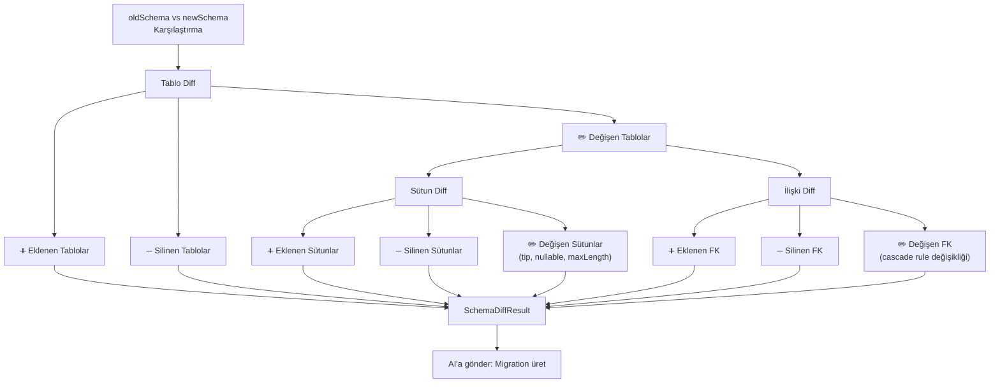

#### Teknik Checklist

**Backend (C#):**

- [ ] `Namines.Core/Interfaces/` → `IMigrationService.cs`:
  ```csharp
  public interface IMigrationService
  {
      Task<DatabaseSchema> ParseDbContextAsync(string dbContextCode, DatabaseType dbType);
      Task<SchemaDiffResult> CalculateDiffAsync(DatabaseSchema oldSchema, DatabaseSchema newSchema);
      Task<MigrationResult> GenerateMigrationAsync(
          DatabaseSchema oldSchema,
          DatabaseSchema newSchema,
          DatabaseType dbType,
          string migrationName);
  }
  ```
- [ ] `Namines.Core/Models/` → Yeni modeller:
  ```csharp
  public class SchemaDiffResult
  {
      public List<TableDiff> AddedTables { get; set; }
      public List<TableDiff> RemovedTables { get; set; }
      public List<TableChangeDiff> ModifiedTables { get; set; }
      public int TotalChanges { get; set; }
      public bool HasBreakingChanges { get; set; }
  }

  public class MigrationResult
  {
      public string MigrationName { get; set; }        // "AddSiparislerTable"
      public string UpCode { get; set; }               // C# Up() metodu
      public string DownCode { get; set; }              // C# Down() metodu
      public string RawSql { get; set; }                // Alternatif: Raw SQL migration
      public List<string> Warnings { get; set; }        // "Sütun silme veri kaybına yol açabilir"
      public string Summary { get; set; }               // İnsan-okunabilir değişiklik özeti
  }
  ```
- [ ] `Namines.Infrastructure/Services/` → `MigrationService.cs`:
  - `ParseDbContextAsync()` → AI ile DbContext → JSON şema dönüşümü
  - `CalculateDiffAsync()` → İki şemayı karşılaştır (yerel algoritma, AI gerektirmez)
  - `GenerateMigrationAsync()` → Diff sonucunu AI'a gönder → EF Core migration kodu
- [ ] `Namines.Infrastructure/Prompts/` → `MigrationPromptBuilder.cs`:
  ```
  Sen kıdemli bir Entity Framework Core uzmanısın.
  İki veritabanı şeması arasındaki farklar (diff) sana verilecek.
  Bu farkları uygulayan bir EF Core Migration dosyası üret.

  Up() metodu: Eski şemadan yeni şemaya geçiş
  Down() metodu: Yeni şemadan eski şemaya geri dönüş

  KURALLAR:
  1. migrationBuilder API'sini kullan
  2. Veri kaybı riski varsa yorum ile uyar
  3. Index ve FK constraint'leri dahil et
  4. Sütun tipi değişikliklerinde .AlterColumn() kullan
  ```
- [ ] `Namines.Infrastructure/Prompts/` → `DbContextParsePromptBuilder.cs`:
  ```
  Bu C# DbContext dosyasını analiz et.
  İçindeki DbSet<> tanımlarını, entity konfigürasyonlarını,
  ilişkileri ve constraint'leri çıkart.
  Sonucu Namines DatabaseSchema JSON formatında dön.
  ```
- [ ] `MigrationController.cs` → Tam implementasyon:
  ```
  POST /api/migration/parse      → DbContext dosyası yükle, şema JSON dön
  POST /api/migration/diff       → İki şema karşılaştır, diff dön
  POST /api/migration/generate   → Migration Up/Down kodu üret
  ```

**Frontend (Next.js):**

- [ ] `components/migration/MigrationWizard.tsx` → 3 adımlı wizard:
  ```
  ┌──────────────────────────────────────────────────────┐
  │  Adım 1: DbContext Yükle                             │
  │  ┌────────────────────────────────────────────────┐  │
  │  │  📄 DbContext.cs dosyanızı sürükleyip bırakın  │  │
  │  │  veya [Dosya Seç] butonuna tıklayın            │  │
  │  └────────────────────────────────────────────────┘  │
  │                                                      │
  │  Adım 2: Canvas'ta Düzenle                           │
  │  [Mevcut şema Canvas'ta gösterilir — düzenleme yapın]│
  │                                                      │
  │  Adım 3: Migration Üret                              │
  │  [Migration kodu diff görünümünde gösterilir]         │
  └──────────────────────────────────────────────────────┘
  ```
- [ ] `components/migration/DiffViewer.tsx` → Side-by-side diff görünümü:
  - Sol panel: Eski şema (kırmızı highlight — silinen)
  - Sağ panel: Yeni şema (yeşil highlight — eklenen)
  - Orta: Değişiklik özeti
- [ ] `components/migration/MigrationCodeView.tsx`:
  - Syntax-highlighted C# kodu (Up/Down ayrı tab'lar)
  - Raw SQL alternatif tab'ı
  - "📋 Kopyala" + "💾 İndir (.cs)" butonları
  - Breaking change uyarıları (kırmızı banner)
- [ ] Canvas'ta diff renklendirmesi:
  - 🔵 Mavi kenarlık: Değişmeyen tablolar
  - 🟢 Yeşil kenarlık + glow: Yeni eklenen
  - 🟡 Sarı kenarlık + pulse: Değişen
  - 🔴 Kırmızı kenarlık + fade: Silinecek olan
- [ ] Drag & drop dosya yükleme (`.cs` file filter)
- [ ] Migration geçmişi (localStorage) — son 5 migration kaydı

**AI (Groq):**

- [ ] DbContext parse prompt'u — C# syntax farkındalığı
- [ ] Migration üretim prompt'u — EF Core API bilgisi
- [ ] Breaking change tespiti: Sütun silme, tip değiştirme, FK kaldırma

#### Risk & Mitigasyon

| Risk | Olasılık | Etki | Mitigasyon |
|------|----------|------|------------|
| DbContext parse hatası (karmaşık konfigürasyonlar) | Yüksek | Yüksek | Fluent API + Data Annotations ayrı ayrı destekle; hata durumunda kullanıcıya manual düzeltme imkanı |
| Veri kaybı riski (sütun silme migration'ları) | Orta | Çok Yüksek | Breaking change uyarıları; Down() migration her zaman üret; kullanıcı onayı zorunlu |
| AI'ın yanlış EF Core API kullanması | Orta | Yüksek | EF Core 8 API referansını prompt'a ekle; output validation |
| Büyük şema diff hesaplama performansı | Düşük | Düşük | Diff algoritması yerel çalışır, AI sadece kod üretiminde kullanılır |

**Tahmini Efor:** 24-32 saat
**Öncelik:** 🔵 P2 — Orta (Güçlü diferansiyasyon özelliği ama kompleks)

---

### 4.4 Reverse Engineering — Beyaz Tahtadan Koda

#### Vizyon

Kullanıcının fiziksel bir beyaz tahtaya veya kağıda çizdiği derme çatma veritabanı şemasının (kutular, oklar, yazılar) fotoğrafını sisteme yüklemesi. **AI Vision modelinin** bu görseli analiz edip:

1. Tablo adlarını tespit etmesi
2. Sütun adları ve tiplerini çıkartması
3. İlişkileri (okları) yorumlaması
4. Saniyeler içinde **React Flow Canvas'ına** dijital tablo ve ilişkiler olarak aktarması

#### Mimari Akış

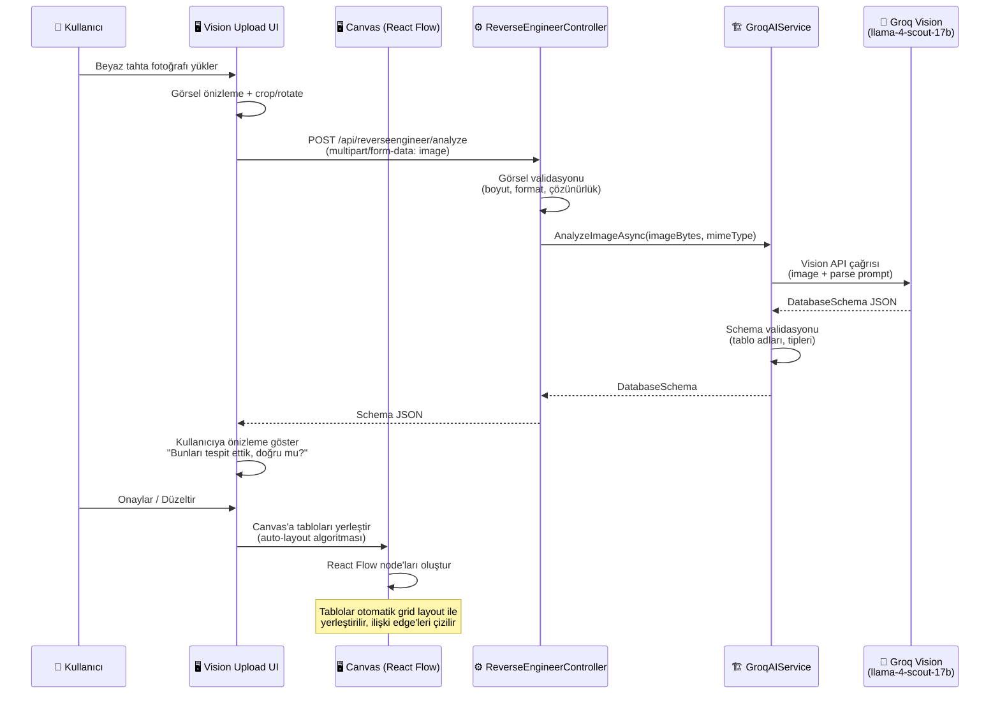

#### Vision AI Pipeline

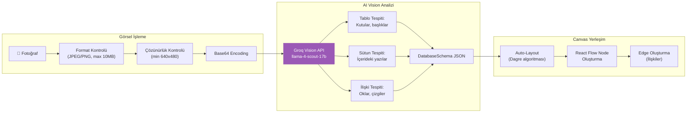

#### Teknik Checklist

**Backend (C#):**

- [ ] `ReverseEngineerController.cs` → Tam implementasyon:
  ```
  POST /api/reverseengineer/analyze   → Multipart image upload → Schema JSON dön
  ```
  - Request: `IFormFile image` (JPEG, PNG — max 10MB)
  - Response: `DatabaseSchema` JSON
- [ ] Görsel validasyonu middleware/service:
  - Desteklenen formatlar: JPEG, PNG, WebP
  - Maksimum boyut: 10MB
  - Minimum çözünürlük: 640x480
  - Hata mesajları: "Görsel çok küçük", "Desteklenmeyen format"
- [ ] `GroqAIService.AnalyzeImageAsync()` → Mevcut implementasyonu güncelle:
  - Vision prompt'unu Namines `DatabaseSchema` formatına uygun yap
  - Yanıt validasyonu: Dönen JSON'ın geçerli bir `DatabaseSchema` olup olmadığını kontrol et
- [ ] `Namines.Infrastructure/Prompts/` → `VisionPromptBuilder.cs`:
  ```
  Bu görselde elle çizilmiş bir veritabanı şeması var.
  Görseli analiz et ve aşağıdaki bilgileri çıkart:

  1. TABLOLAR: Her kutu bir tablo. Kutunun üstündeki veya içindeki kalın yazı tablo adıdır.
  2. SÜTUNLAR: Her kutunun içindeki satırlar sütunlardır.
     - "PK" veya anahtar simgesi → Primary Key
     - Yanında tip yazıyorsa (int, varchar, date) onu kullan
     - Tip yazılmamışsa adından tahmin et (id→int, name→nvarchar(100), date→datetime, price→decimal)
  3. İLİŞKİLER: Kutular arasındaki oklar FK ilişkileridir.
     - Okun başladığı tablo → Child (FK sütunu burada)
     - Okun gittiği tablo → Parent (PK referansı)
     - "1-N", "N-M" gibi yazılar varsa ilişki tipini belirle

  ÇIKTI: DatabaseSchema JSON formatında. Şema:
  {schemaFormat}
  
  EL YAZISI OKUMA İPUÇLARI:
  - Yazı okunamazsa en mantıklı tahminini yap
  - Türkçe karakter varsa koru (ğ, ü, ş, ı, ö, ç)
  - Tablo/sütun adlarını PascalCase'e çevir
  ```

**Frontend (Next.js):**

- [ ] `components/canvas/VisionUploadModal.tsx` → Görsel yükleme modal'ı:
  ```
  ┌──────────────────────────────────────────────────────┐
  │  📸 Beyaz Tahtadan İçe Aktar                         │
  │                                                      │
  │  ┌────────────────────────────────────────────────┐  │
  │  │                                                │  │
  │  │   📷 Fotoğrafınızı sürükleyip bırakın         │  │
  │  │   veya [Dosya Seç] / [📷 Kamera] tıklayın    │  │
  │  │                                                │  │
  │  │   Desteklenen: JPEG, PNG (max 10MB)           │  │
  │  └────────────────────────────────────────────────┘  │
  │                                                      │
  │  💡 İpucu: Tabloları kutular, ilişkileri oklar       │
  │  olarak çizin. Sütun tiplerini yazmak opsiyoneldir. │
  └──────────────────────────────────────────────────────┘
  ```
- [ ] Görsel önizleme + basit düzenleme:
  - Crop (kırpma)
  - Rotate (döndürme)
  - Brightness/Contrast ayarı (opsiyonel)
- [ ] `components/canvas/VisionPreviewPanel.tsx` → AI sonuç önizlemesi:
  - Yüklenen görsel (sol)
  - Tespit edilen tablolar listesi (sağ)
  - Her tablo yanında ✅/❌ onay checkbox'ı
  - Sütun tiplerini düzeltme imkanı (inline edit)
  - "Canvas'a Aktar" butonu
- [ ] Canvas'a aktarma:
  - `useSchemaStore` → `importFromVision(schema)` action
  - Auto-layout: `dagre` kütüphanesi ile tablo node'larını düzenli yerleştir
  - Yeni eklenen node'lar parlak animasyonla belir (fade-in + scale)
- [ ] Canvas toolbar'a "📸 Beyaz Tahtadan İçe Aktar" butonu ekle
- [ ] Mobil destek: Kamera API ile direkt fotoğraf çekme

**AI (Groq Vision):**

- [ ] `llama-4-scout-17b-16e-instruct` modeli ile vision analizi
- [ ] Prompt'ta örnek el çizimleri ve beklenen çıktılar (few-shot — metin olarak tanımla)
- [ ] Güven skoru: Her tespit edilen öğe için confidence (0-1) değeri
- [ ] Düşük güvenli tespitler sarı ile işaretlensin → kullanıcı doğrulasın

#### Risk & Mitigasyon

| Risk | Olasılık | Etki | Mitigasyon |
|------|----------|------|------------|
| El yazısı okunamaz (kötü fotoğraf kalitesi) | Yüksek | Yüksek | Minimum çözünürlük zorunluluğu; kullanıcıya "net çekin" uyarısı; AI confidence threshold altındaki tespitlerde uyarı |
| Vision modelin Türkçe karakterleri yanlış okuması | Orta | Orta | Post-processing: Yaygın Türkçe karakter düzeltmeleri (ı↔i, ö↔o, ü↔u) |
| İlişki okları karmaşık (çapraz, üst üste binen) | Yüksek | Orta | AI'a sadece basit ok tespiti yaptır; karmaşık ilişkileri kullanıcı Canvas'ta düzeltsin |
| Çok fazla tablo (10+) görselini doğru parse edememe | Orta | Orta | "Fotoğrafı bölümlere ayırarak çekin" önerisi; veya çoklu fotoğraf yükleme desteği |
| Groq Vision API'nin rate limit'i | Düşük | Yüksek | Görsel önce istemci tarafında sıkıştır (max 2MB); per-user günlük limit (10 analiz) |

**Tahmini Efor:** 20-28 saat
**Öncelik:** 🟣 P2 — Orta (WOW faktörü çok yüksek, demo/pazarlama değeri büyük)

---

## 5. Küresel Risk Analizi & Mitigasyon Matrisi

### 5.1 Risk Haritası (Isı Matrisi)

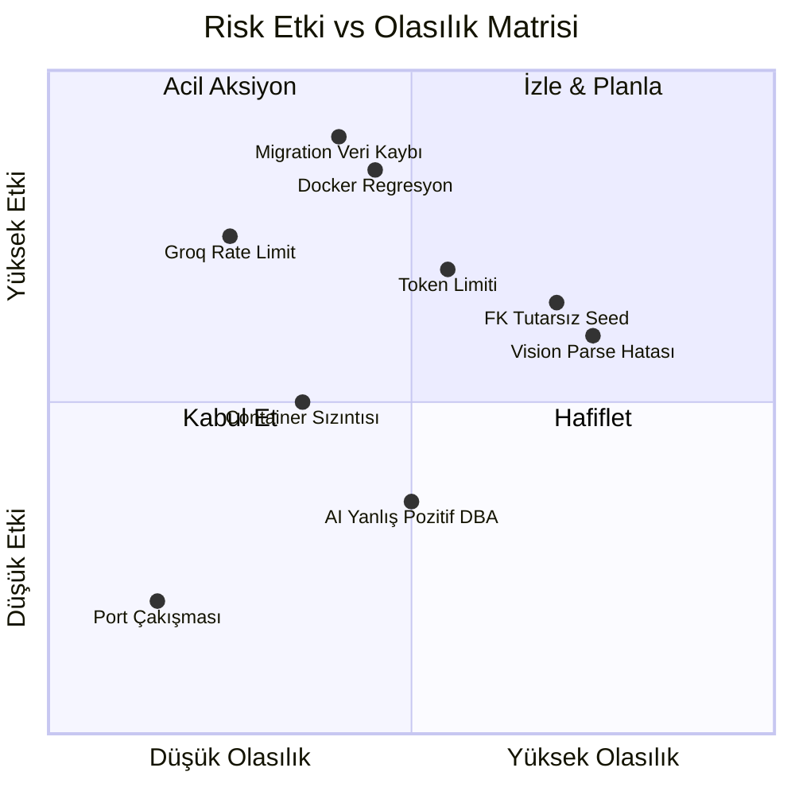

### 5.2 Detaylı Risk Tablosu

| ID | Risk | Kategori | Olasılık | Etki | Risk Skoru | Mitigasyon Stratejisi | Sahip |
|----|------|----------|----------|------|------------|----------------------|-------|
| R01 | Docker backup regresyonu (Stabilizasyon sırasında) | Teknik | Orta | Çok Yüksek | 🔴 8/10 | Refactoring öncesi snapshot/smoke test; aşamalı refactoring | Backend Dev |
| R02 | Groq token limiti — büyük şemalar | Teknik | Yüksek | Yüksek | 🔴 8/10 | Dinamik max_tokens; şema sadeleştirme fallback; `finish_reason` kontrolü | Backend Dev |
| R03 | Vision AI parse hatası | AI/ML | Yüksek | Yüksek | 🔴 8/10 | Confidence threshold; kullanıcı doğrulama adımı; görsel kalite rehberi | AI Engineer |
| R04 | Migration — veri kaybı riski | İş | Orta | Çok Yüksek | 🟠 7/10 | Breaking change uyarıları; Down() zorunlu; kullanıcı onay mekanizması | Backend Dev |
| R05 | FK tutarsız seed verisi | AI/ML | Yüksek | Yüksek | 🟠 7/10 | Backend'de insert sıralaması kontrolü; AI'a explicit ID mapping | Backend Dev |
| R06 | Groq API rate limit / downtime | Altyapı | Düşük | Çok Yüksek | 🟡 5/10 | Yerel kurallar fallback (DBA); cache mekanizması; kuyruk sistemi | DevOps |
| R07 | Docker container sızıntısı (Zip & Go sonrası kalıntı) | Altyapı | Orta | Orta | 🟡 4/10 | Container başlatma kaldırıldığı için risk minimal; cleanup script | DevOps |
| R08 | AI DBA yanlış pozitif | AI/ML | Orta | Düşük | 🟢 3/10 | "AI Önerisi" etiketi; kullanıcı geri bildirimi; kural iyileştirme | AI Engineer |
| R09 | Frontend performans (çok overlay/node) | Teknik | Düşük | Orta | 🟢 3/10 | React.memo; virtualization; 50+ issue'da sayfalama | Frontend Dev |
| R10 | HttpClient idle connection timeout | Teknik | Düşük | Düşük | 🟢 2/10 | Keep-alive headers; connection pooling | Backend Dev |

### 5.3 Genel Mitigasyon İlkeleri

> [!CAUTION]
> **Altın Kural:** Her AI çıktısı (schema, migration kodu, seed SQL) kullanıcıya gösterilmeden ÖNCE backend validasyonundan geçmelidir. AI çıktısına doğrudan güvenme — "Trust but Verify" prensibi.

1. **AI Fallback Chain:** Groq API başarısız → Yerel kurallar çalışır → Kullanıcıya "AI şu an müsait değil" uyarısı
2. **Graceful Degradation:** Her modül bağımsız çalışır. Bir modülün başarısızlığı diğerlerini etkilemez.
3. **Rate Limiting:** Per-user, per-endpoint rate limit. Vision: 10/gün, DBA: 30/saat, Seed: 20/saat.
4. **Audit Log:** Tüm AI çağrıları ve sonuçları loglanır (debugging ve iyileştirme için).

---

## 6. Efor & Önceliklendirme Tablosu

### 6.1 Bölüm 1 — Stabilizasyon

| Görev | Efor (saat) | Öncelik | Bağımlılık | Blokluyor |
|-------|-------------|---------|------------|-----------|
| 3.1 Docker .bak İzolasyonu | 4-6 | 🔴 P0 | Yok | Bölüm 2 tümü |
| 3.2 Kapasite Artırımı (Token + Timeout) | 2-3 | 🔴 P0 | Yok | 4.1, 4.2, 4.3 |
| 3.3 Zip & Go Frontend | 6-8 | 🟡 P1 | 3.1 | Yok (paralel geliştirilebilir) |
| **Toplam Bölüm 1** | **12-17** | | | |

### 6.2 Bölüm 2 — Deep Impact

| Görev | Efor (saat) | Öncelik | Bağımlılık | Paralel? |
|-------|-------------|---------|------------|----------|
| 4.1 AI DBA Linter | 24-32 | 🟢 P1 | Bölüm 1 | ✅ Evet |
| 4.2 Smart Seeding | 16-24 | 🟢 P1 | Bölüm 1 | ✅ Evet |
| 4.3 Migration Engine | 24-32 | 🔵 P2 | Bölüm 1 | ✅ Evet |
| 4.4 Reverse Engineering | 20-28 | 🟣 P2 | Bölüm 1 | ✅ Evet |
| **Toplam Bölüm 2** | **84-116** | | | |

### 6.3 Önerilen Geliştirme Sırası

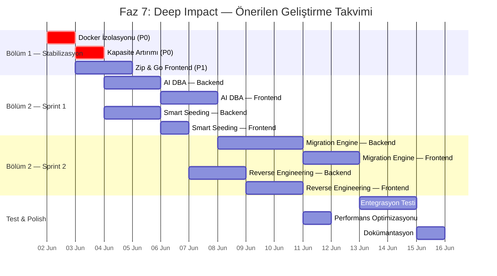

> [!TIP]
> **Önerilen Başlangıç:** Stabilizasyon (Bölüm 1) → AI DBA + Smart Seeding (paralel) → Migration → Reverse Engineering
>
> AI DBA ve Smart Seeding birbirinden bağımsızdır ve paralel geliştirilebilir. Migration ve Reverse Engineering daha kompleks olduğundan ikinci sprint'e bırakılması önerilir.

---

## 7. Bağımlılık Grafiği

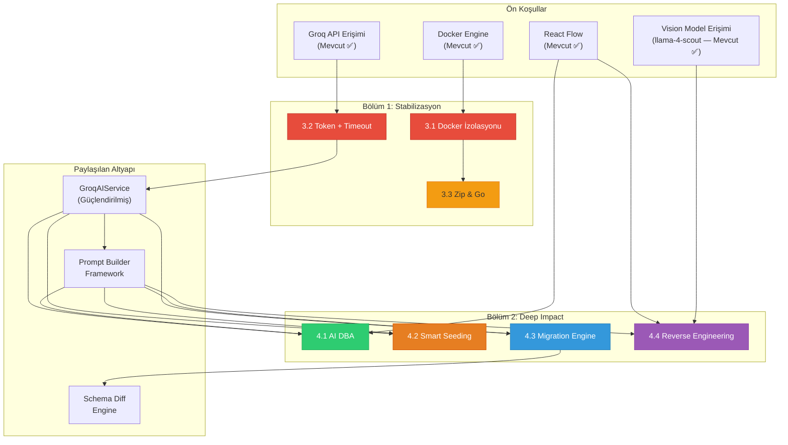

---

## 8. Sonuç & Onay

### Çıktı Özeti

Bu belge, Namines projesinin **Faz 7: Deep Impact** dönüşümü için kapsamlı bir mimari plan sunmaktadır:

| Metrik | Değer |
|--------|-------|
| **Toplam Modül Sayısı** | 7 (3 stabilizasyon + 4 inovasyon) |
| **Toplam Efor Tahmini** | 96-133 saat (~12-17 iş günü) |
| **Yeni Controller Sayısı** | 2 (AIDbaController, SmartSeedController) + 2 güncelleme |
| **Yeni Service/Interface** | 4 yeni (IAIDbaService, ISmartSeedService, IMigrationService + impl) |
| **Yeni Frontend Bileşen** | ~12 yeni bileşen |
| **Yeni AI Prompt** | 5 yeni prompt builder |
| **Risk Sayısı** | 10 (2 kritik, 3 yüksek, 3 orta, 2 düşük) |

### Başarı Kriterleri

| # | Kriter | Ölçüm |
|---|--------|-------|
| ✅ | .bak üretimi 3 DB tipinde sorunsuz çalışır | %100 başarı oranı |
| ✅ | 25+ tablolu şemalar kesintisiz işlenir | JSON parse başarısı |
| ✅ | Canlı iframe kaldırılmış, ZIP indirme aktif | 0 Docker container sızıntısı |
| ✅ | AI DBA en az 10 kural ile çalışır | ≤2s yerel analiz süresi |
| ✅ | Smart Seed FK-tutarlı veri üretir | Referans bütünlüğü testi geçer |
| ✅ | Migration Up/Down kodu derlenebilir | C# syntax validasyonu |
| ✅ | Beyaz tahta fotoğrafından ≥3 tablo tespit | Kontrollü test seti ile ≥%80 doğruluk |

---

> [!IMPORTANT]
> **Bu belge onay gerektirir.** Bölüm 1 (Stabilizasyon) çalışmalarına başlamadan önce bu planın gözden geçirilip onaylanması beklenmektedir.

---

**Hazırlayan:** Darvell Labs CTO Office
**Revizyon:** v1.0
**Son Güncelleme:** 30 Mayıs 2026
