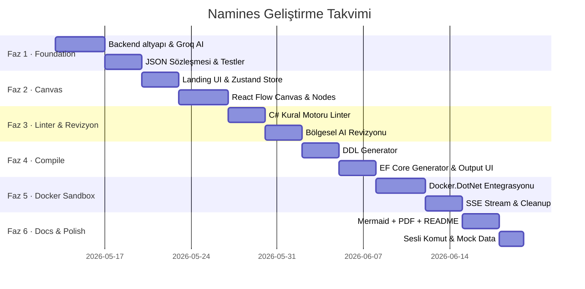

# Namines — Adım Adım Geliştirme Yol Haritası
> Her görev **bağımsız, test edilebilir** bir birim. Checkbox'ları işaretleyerek ilerle.

---

## 🗺️ Genel Bakış



---

## FAZ 1 — Foundation (Backend Altyapısı + AI Bağlantısı)
> **Başlangıç koşulu:** Solution ve klasör yapısı hazır ✅
> **Bitiş kriteri:** Postman'dan prompt gönderilince geçerli JSON şeması dönüyor.

### 1.1 — Proje Referansları ve NuGet Paketleri

- [ ] `TBD.API` → `TBD.Core` ve `TBD.Infrastructure` proje referansları ekle
- [ ] `TBD.Infrastructure` → `TBD.Core` proje referansı ekle
- [ ] `TBD.Infrastructure`'a NuGet ekle:
  - `Groq.Net` veya `OpenAI` (HTTP client için `Microsoft.Extensions.Http`)
  - `Docker.DotNet`
  - `QuestPDF`
- [ ] `TBD.API`'ye NuGet ekle:
  - `Microsoft.AspNetCore.OpenApi`
  - `Swashbuckle.AspNetCore`

### 1.2 — Core: JSON Sözleşmesi ve Domain Modeller

- [ ] `TBD.Core/Enums/` → `DatabaseType.cs`, `ColumnType.cs`, `RelationshipType.cs` yaz
- [ ] `TBD.Core/Entities/` → `SchemaTable.cs`, `SchemaColumn.cs`, `SchemaRelation.cs` yaz
- [ ] `TBD.Core/Models/DatabaseSchema.cs` yaz — **tüm sistemin JSON sözleşmesi**
- [ ] `TBD.Core/Models/` → `GenerateRequest.cs`, `ReviseRequest.cs`, `LintResult.cs`, `CompileRequest.cs`, `DockerJobResult.cs` yaz
- [ ] `TBD.Core/Interfaces/IAIService.cs` yaz:
  ```csharp
  Task<DatabaseSchema> GenerateSchemaAsync(GenerateRequest req);
  Task<DatabaseSchema> ReviseSchemaAsync(ReviseRequest req);
  ```

### 1.3 — Core: Prompt Builder'lar

- [ ] `TBD.Core/Prompts/SchemaPromptBuilder.cs` yaz
  - `BuildSystemPrompt()` → JSON-only kısıtlı system mesajı
  - `BuildUserPrompt(string userInput, DatabaseType dbType)` → user mesajı
- [ ] `TBD.Core/Prompts/RevisionPromptBuilder.cs` yaz
  - `BuildRevisionPrompt(List<SchemaTable> selectedTables, string userRequest)` → sadece seçili tabloları gönder
- [ ] `TBD.Core/Prompts/MockDataPromptBuilder.cs` yaz (Faz 6 için hazır bırak)

### 1.4 — Infrastructure: GroqAI Servisi

- [ ] `TBD.Infrastructure/AI/GroqAIService.cs` implement et:
  - `IAIService` interface'ini uygula
  - `HttpClient` ile Groq chat completions API'sini çağır
  - Response'dan JSON bloğunu parse et → `DatabaseSchema` döndür
  - JSON parse hatası durumunda retry (max 2 kez, farklı `temperature` ile)

### 1.5 — API: DI Kaydı ve İlk Controller

- [ ] `TBD.API/Extensions/ServiceCollectionExtensions.cs` yaz — tüm servisleri kaydet
- [ ] `TBD.API/Middleware/ExceptionMiddleware.cs` yaz — global 500 handler
- [ ] `Program.cs` güncelle: CORS (Next.js 3000), Swagger, Middleware, Extension
- [ ] `TBD.API/Controllers/SchemaController.cs` yaz:
  - `POST /api/schema/generate` → `IAIService.GenerateSchemaAsync`
  - `POST /api/schema/revise` → `IAIService.ReviseSchemaAsync`
- [ ] `appsettings.json`'a `GroqApiKey` ve `GroqModel` ekle

### ✅ Faz 1 Doğrulama

```bash
# Swagger UI açık
# Postman ile test:
POST http://localhost:5000/api/schema/generate
{ "prompt": "E-ticaret sistemi", "dbType": "MSSQL" }
# Beklenen: Geçerli DatabaseSchema JSON dönmeli
```

---

## FAZ 2 — Canvas (Frontend Landing + React Flow)
> **Başlangıç koşulu:** Faz 1 endpoint'leri çalışıyor.
> **Bitiş kriteri:** Prompt yazılınca canvas açılıyor, tablolar node olarak görünüyor, sürüklenebiliyor.

### 2.1 — TypeScript Tipleri ve API Servisi

- [ ] `frontend/types/schema.ts` → `DatabaseSchema`, `SchemaTable`, `SchemaColumn`, `SchemaRelation` tiplerini yaz (backend modelle birebir uyumlu)
- [ ] `frontend/services/api.ts` → Axios instance yaz, temel endpoint metodlarını ekle:
  - `generateSchema(prompt, dbType)`
  - `reviseSchema(selectedTables, prompt)`
  - `lintSchema(schema)`
  - `compileSql(schema, dbType)`

### 2.2 — Lib: JSON ↔ React Flow Dönüşümleri

- [ ] `frontend/lib/schemaToFlow.ts` yaz:
  - Her `SchemaTable` → bir `Node` (type: `tableNode`)
  - Her `SchemaRelation` → bir `Edge` (type: `relationEdge`)
  - Node pozisyonlarını otomatik hesapla (grid layout veya dagre)
- [ ] `frontend/lib/flowToSchema.ts` yaz:
  - `nodes[]` + `edges[]` → `DatabaseSchema` JSON
  - Sadece compile anında çağrılır

### 2.3 — Zustand Store

- [ ] `frontend/store/useSchemaStore.ts` yaz:
  - State: `schema`, `nodes`, `edges`, `selectedTableIds`, `isDirty`, `isGenerating`
  - Actions: `loadFromSchema`, `updateNodePosition`, `updateColumnName`, `addEdge`, `removeEdge`, `setSelectedTables`, `applyRevision`, `toSchema`
- [ ] `frontend/store/useLinterStore.ts` yaz:
  - State: `lintErrors[]`, `isLinting`
  - Actions: `setErrors`, `clearErrors`

### 2.4 — Landing Sayfası (app/page.tsx)

- [ ] `PromptInput.tsx` → büyük textarea, placeholder metni, "Oluştur" butonu
- [ ] `TemplateGrid.tsx` → E-Ticaret, Lojistik, Blog, Hastane hazır şablonları (tıklayınca textarea'yı doldurur)
- [ ] `app/page.tsx` → Layout: merkez konumlu prompt + şablon grid
  - Form submit → `api.generateSchema()` çağır → `store.loadFromSchema()` → `router.push('/canvas')`
  - Loading state sırasında animasyonlu skeleton

### 2.5 — React Flow Canvas (app/canvas/page.tsx)

- [ ] `components/canvas/nodes/TableNode.tsx` yaz:
  - Tablo adı header
  - Kolon listesi (PK 🔑, FK 🔗 ikonları)
  - Kolon üzerine tıklayınca `ColumnEditor` sidebar'ını aç
- [ ] `components/canvas/edges/RelationEdge.tsx` yaz:
  - Custom label: `1:N` veya `N:M`
  - Delete butonu (hover'da görünür)
- [ ] `components/canvas/SchemaCanvas.tsx` yaz:
  - `ReactFlow` wrapper, `nodeTypes`, `edgeTypes` tanımları
  - `onNodesChange` → `store.updateNodePosition`
  - `onEdgesChange` → `store.removeEdge`
  - `onConnect` → `store.addEdge`
  - `onSelectionChange` → `store.setSelectedTables` (Shift+Click)
- [ ] `components/canvas/sidebar/ColumnEditor.tsx` yaz:
  - Seçili kolonu düzenleme formu (isim, tip, nullable, default)
  - Kaydet → `store.updateColumnName`
- [ ] `components/canvas/panels/ToolbarPanel.tsx` yaz:
  - Auto-layout butonu (dagre ile düzen)
  - "Diyagramı Onayla" butonu → `/compile` sayfasına yönlendir

### ✅ Faz 2 Doğrulama

```
1. Landing'de "Bir e-ticaret veritabanı oluştur" yaz
2. Submit → Canvas açılmalı
3. Users, Orders, Products tabloları node olarak görünmeli
4. Aralarında ilişki edge'leri olmalı (1:N)
5. Tablo sürüklenince pozisyonu korumalı
6. Kolona tıklayınca sidebar açılmalı
```

---

## FAZ 3 — Linter & Bölgesel AI Revizyonu
> **Başlangıç koşulu:** Canvas çalışıyor, manuel düzenleme mümkün.
> **Bitiş kriteri:** Hatalı FK bağlantısı kırmızı uyarı gösteriyor; seçili tabloları AI ile revize edebiliyoruz.

### 3.1 — Backend: C# Kural Motoru Linter

- [ ] `TBD.Core/Interfaces/ILinterService.cs` → `LintResult Lint(DatabaseSchema schema)` yaz
- [ ] `TBD.Infrastructure/` altında `LinterService.cs` implement et:
  - **Kural 1:** FK kolonu tipi ≠ referans PK tipi → `Error`
  - **Kural 2:** Tabloda birden fazla PK → `Error`
  - **Kural 3:** Tablo veya kolon adı boş/sadece boşluk → `Error`
  - **Kural 4:** İlişki kaynak/hedef tablo mevcut değil → `Error`
  - **Kural 5:** Döngüsel FK zinciri (A→B→A) → `Warning`
  - **Kural 6:** Tabloda PK yok → `Warning`
  - **Kural 7:** PascalCase dışı isimlendirme → `Info`
- [ ] `LintController.cs` → `POST /api/lint` endpoint'ini bağla
- [ ] DI kaydı: `ServiceCollectionExtensions`'a `ILinterService` ekle

### 3.2 — Frontend: Linter Entegrasyonu

- [ ] `frontend/hooks/useLinter.ts` yaz:
  - Schema değişince 500ms debounce ile `api.lintSchema()` çağır
  - Sonuçları `useLinterStore`'a yaz
- [ ] `components/canvas/panels/LinterPanel.tsx` yaz:
  - Hata listesi (Error 🔴 / Warning 🟡 / Info 🔵)
  - Hata olan node'u highlight et (kırmızı border)
  - Panel collapsible — sağ alt köşede floating
- [ ] Canvas'ta linter hook'unu store subscribe ile bağla

### 3.3 — Backend: Bölgesel AI Revizyonu

- [ ] `ReviseRequest.cs`'i güncelle: `SelectedTables[]` + `RevisionPrompt` alanları
- [ ] `RevisionPromptBuilder.cs`'i finalize et
- [ ] `IAIService.ReviseSchemaAsync` implementasyonu:
  - Sadece seçili tabloların JSON'unu gönder
  - Dönen partial schema'yı `DatabaseSchema` olarak parse et
  - Ana schema'da sadece etkilenen tabloları merge et
- [ ] `SchemaController.cs` → `POST /api/schema/revise` endpoint'ini aktifleştir

### 3.4 — Frontend: Regional Prompt Panel

- [ ] `components/canvas/panels/RegionalPromptPanel.tsx` yaz:
  - `selectedTableIds.length > 0` ise göster
  - Seçili tablo sayısını göster ("2 tablo seçili")
  - Prompt textarea + "AI ile Revize Et" butonu
  - Submit → `api.reviseSchema(selectedTables, prompt)` → `store.applyRevision(result)`
- [ ] `store.applyRevision` action'ını yaz:
  - Dönen tabloları mevcut `schema.tables`'a merge et (id bazlı)
  - `schemaToFlow` yeniden çalıştır → `nodes/edges` güncelle

### ✅ Faz 3 Doğrulama

```
1. Canvas'ta Users.Id (INT) → Orders.UserId (VARCHAR) bağla
2. Linter panelinde "FK tipi uyuşmazlığı" hatası görünmeli
3. Shift+Click ile Orders ve Products'ı seç
4. Regional prompt: "Bu iki tablo arasına OrderItems ara tablosu ekle"
5. Canvas'ta OrderItems tablosu eklenmeli, diğer tablolar bozulmadan kalmalı
```

---

## FAZ 4 — Compile & Output (DDL + EF Core Üretimi)
> **Başlangıç koşulu:** Schema düzenleme ve linting çalışıyor.
> **Bitiş kriteri:** Onay sonrası MSSQL DDL ve C# EF Core dosyaları indirilebilir.

### 4.1 — Backend: DDL Generator'lar

- [ ] `TBD.Core/Interfaces/IDdlGenerator.cs` yaz:
  - `string Generate(DatabaseSchema schema)`
- [ ] `MssqlDdlGenerator.cs` implement et:
  - CREATE TABLE (her tablo için)
  - PRIMARY KEY constraint
  - FOREIGN KEY + REFERENCES + ON DELETE CASCADE
  - UNIQUE, NOT NULL kısıtları
  - Her tabloya `CreatedAt DATETIME DEFAULT GETDATE()` otomatik ekle
- [ ] `PostgresDdlGenerator.cs` implement et (SERIAL, TIMESTAMP, REFERENCES)
- [ ] `MySqlDdlGenerator.cs` implement et (AUTO_INCREMENT, ENGINE=InnoDB)
- [ ] Generator factory: `IDdlGenerator GetGenerator(DatabaseType dbType)` yaz
- [ ] `CompileController.cs` → `POST /api/compile/sql` endpoint bağla

### 4.2 — Backend: EF Core Generator

- [ ] `TBD.Core/Interfaces/IEfCoreGenerator.cs` yaz
- [ ] `ModelClassGenerator.cs` implement et:
  - Her tablo → `{TableName}.cs` model sınıfı (Data Annotation'lı)
  - `[Key]`, `[Required]`, `[MaxLength]`, `[ForeignKey]` attribute'ları
  - Navigation property'ler (virtual ICollection<Order> Orders)
- [ ] `DbContextGenerator.cs` implement et:
  - `AppDbContext.cs` → tüm `DbSet<>` property'ler
  - `OnModelCreating` override ile Fluent API konfigürasyonu
- [ ] `CompileController.cs` → `POST /api/compile/efcore` endpoint bağla
- [ ] `FileStorageService.cs` yaz:
  - `outputs/` klasörüne zip olarak kaydet
  - Download URL üret (static file serving)

### 4.3 — Frontend: Compile Sayfası (app/compile/page.tsx)

- [ ] `DbTypeSelector.tsx` → MSSQL / PostgreSQL / MySQL toggle
- [ ] `SqlPreview.tsx` → syntax highlighting ile DDL göster (Prism.js)
- [ ] `OutputActions.tsx`:
  - "SQL İndir" → API'den zip al, tarayıcı indirme
  - "EF Core İndir" → `.cs` dosyaları zip
  - "Kopyala" → clipboard
  - "Docker Sandbox Çalıştır" → Faz 5 butonu (disabled şimdilik)
- [ ] Sayfa: `store.toSchema()` ile güncel schema → API'ye gönder → sonucu göster

### ✅ Faz 4 Doğrulama

```
1. Canvas'ta "Diyagramı Onayla" tıkla
2. Compile sayfasına yönlenmeli
3. MSSQL seç → CREATE TABLE Users (...) DDL görünmeli
4. "SQL İndir" → .sql dosyası inen zip
5. "EF Core İndir" → User.cs, Order.cs, AppDbContext.cs içeren zip
```

---

## FAZ 5 — Docker Sandbox (.bak / dump Üretimi)
> **Başlangıç koşulu:** DDL generator çalışıyor. Docker Desktop kurulu.
> **Bitiş kriteri:** Butona basınca .bak veya .sql dump üretilip indirilebiliyor.

### 5.1 — Backend: Docker.DotNet Entegrasyonu

- [ ] `TBD.Infrastructure` → `Docker.DotNet` NuGet paketi ekle (zaten listede)
- [ ] `ContainerProfiles.cs` yaz — her DB tipi için image ve env konfigürasyonu:
  ```csharp
  MSSQL  → "mcr.microsoft.com/mssql/server:2022-latest", SA_PASSWORD, port 1433
  PG     → "postgres:16-alpine", POSTGRES_PASSWORD, port 5432
  MySQL  → "mysql:8.0", MYSQL_ROOT_PASSWORD, port 3306
  ```
- [ ] `DockerService.cs` implement et — tam lifecycle:
  1. `ConnectAsync()` → Docker engine'e bağlan
  2. `PullImageAsync(image)` → yoksa çek
  3. `CreateContainerAsync(profile)` → random name, random host port, izole network
  4. `StartContainerAsync(containerId)`
  5. `WaitUntilReadyAsync(containerId, timeout: 60s)` → health polling
  6. `ExecCommandAsync(containerId, command)` → DDL'i çalıştır
  7. `BackupDatabaseAsync(containerId, jobId)` → db spesifik backup komutu
  8. `CopyFromContainerAsync(containerId, path)` → backup dosyasını al
  9. `CleanupAsync(containerId)` → stop + remove

### 5.2 — Backend: Docker Job ve SSE Stream

- [ ] `TBD.Core/Models/DockerJobResult.cs` → `JobId`, `Status` (Pending/Running/Done/Failed), `DownloadUrl`, `Progress` (string log) alanları
- [ ] `DockerController.cs` yaz:
  - `POST /api/docker/run` → job başlat, `jobId` dön, `Task.Run` ile background'a at
  - `GET /api/docker/stream/{jobId}` → SSE endpoint, job tamamlanana kadar log'ları yay
- [ ] Job durumu için in-memory `ConcurrentDictionary<string, DockerJobResult>` yaz (basit, Redis değil)

### 5.3 — Frontend: Docker Progress UI

- [ ] `OutputActions.tsx` → "Docker Sandbox" butonunu aktifleştir
- [ ] Docker akışını handle eden hook yaz: `useDockerJob.ts`
  - `POST /api/docker/run` → `jobId` al
  - `EventSource` ile `GET /api/docker/stream/{jobId}` SSE bağlantısı aç
  - Gelen log mesajlarını göster
- [ ] Progress modal bileşeni yaz:
  - Adım adım log (Pulling image... Running migrations... Creating backup...)
  - Tamamlanınca download link göster

### ✅ Faz 5 Doğrulama

```
1. Compile sayfasında MSSQL seçili
2. "Docker Sandbox Çalıştır" tıkla
3. Modal açılmalı: "Pulling mcr.microsoft.com/mssql/server..." logu görünmeli
4. İşlem bitince: "✅ .bak hazır" → İndir butonu aktif
5. İndirilen .bak dosyası SSMS'te restore edilebilmeli
6. Container otomatik silinmiş olmalı (docker ps'de görünmemeli)
```

---

## FAZ 6 — Docs & Polish (Dokümantasyon + Son Dokunuşlar)
> **Başlangıç koşulu:** Tüm core flow çalışıyor.
> **Bitiş kriteri:** Tüm çıktı seçenekleri hazır, UI polish tamamlandı.

### 6.1 — Backend: Mermaid ER Diyagram Generator

- [ ] `MermaidErGenerator.cs` implement et:
  - `erDiagram` formatında string üret
  - Tablolar entity, ilişkiler `||--o{` notasyonu
- [ ] `DocumentationController.cs` → `POST /api/docs/mermaid` endpoint
- [ ] Frontend: Compile sayfasına Mermaid önizleme tab'ı ekle (mermaid.js ile render)

### 6.2 — Backend: PDF Veri Sözlüğü (QuestPDF)

- [ ] `PdfReportGenerator.cs` implement et (QuestPDF):
  - Kapak sayfası (şema adı, tarih, tablo sayısı)
  - Her tablo için: tablo adı, açıklama tablosu (kolon | tip | kısıtlar | açıklama)
  - İlişkiler özet tablosu
- [ ] `DocumentationController.cs` → `POST /api/docs/pdf` endpoint

### 6.3 — Backend: README Generator

- [ ] `ReadmeGenerator.cs` implement et:
  - Markdown template ile şema özetini yaz
  - Tablo listesi, ilişki diyagramı (Mermaid embed), kurulum talimatları

### 6.4 — Frontend: Sesli Komut (Whisper API)

- [ ] `VoiceRecorder.tsx` implement et:
  - `MediaRecorder` ile ses kayıt
  - Blob → `FormData` → backend `/api/voice/transcribe` endpoint
- [ ] `TBD.API/Controllers/VoiceController.cs` yaz:
  - Ses dosyasını Whisper API'ye ilet → metin dön
  - Frontend'de dönen metni PromptInput'a yaz

### 6.5 — Frontend: Mock Data Üretimi

- [ ] `MockDataPromptBuilder.cs` finalize et
- [ ] `SchemaController.cs` → `POST /api/schema/mockdata` endpoint ekle
- [ ] Compile sayfasına "Mock Data Üret" butonu ekle → INSERT scriptleri preview'ı

### 6.6 — Genel UI Polish

- [ ] Dark mode tema renkleri tutarlı hale getir (Tailwind CSS variables)
- [ ] Loading skeleton'ları tüm async işlemlere ekle
- [ ] Mobile responsive (tablet seviyesinde canvas scroll)
- [ ] `output/` klasörü için `.gitignore` ekle
- [ ] `README.md` (proje root) → kurulum ve çalıştırma talimatları
- [ ] `docker-compose.yml` → backend + frontend tek komutla kaldırılabilsin

### ✅ Faz 6 Doğrulama

```
1. Compile sayfasında tüm tab'lar aktif:
   → SQL Preview ✅
   → EF Core ✅
   → Mermaid ER ✅
   → Mock Data ✅
2. "Veri Sözlüğü PDF İndir" → içi dolu PDF
3. "README.md İndir" → GitHub'a direkt atılabilir
4. Landing'de mikrofon butonuna bas → konuş → textarea dolsun
5. docker-compose up → tüm sistem ayağa kalksın
```

---

## 📋 Geliştirme Kuralları

> [!IMPORTANT]
> **Sıra**: Faz'ları sırayla yap. Faz 3'e geçmeden Faz 2 doğrulaması geçmeli.

> [!TIP]
> **API Key Yönetimi**: `appsettings.Development.json` → `.gitignore`'a ekle. Asla commit etme.

> [!WARNING]
> **Docker Sandbox**: Her container'ın `--rm` flag'iyle veya explicit cleanup ile silindiğinden emin ol. Aksi halde disk dolar.

> [!NOTE]
> **Groq Rate Limit**: İlk üretim ve revizyon için `llama-3.3-70b-versatile` kullan. Mock data için daha küçük model (mixtral-8x7b) seçebilirsin — maliyet düşer.

---

## 🏁 Toplam İlerleme

| Faz | Görev Sayısı | Tahmini Süre |
|-----|-------------|--------------|
| Faz 1 – Foundation | 12 görev | 7 gün |
| Faz 2 – Canvas | 13 görev | 7 gün |
| Faz 3 – Linter & Revizyon | 10 görev | 6 gün |
| Faz 4 – Compile & Output | 10 görev | 6 gün |
| Faz 5 – Docker Sandbox | 9 görev | 7 gün |
| Faz 6 – Docs & Polish | 11 görev | 5 gün |
| **TOPLAM** | **65 görev** | **~38 gün** |
