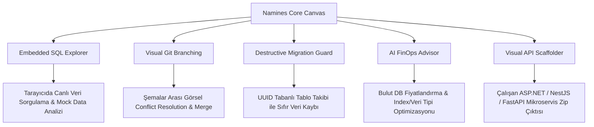
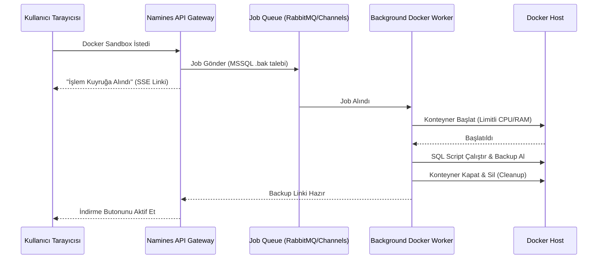

# Namines Strategic Product Innovation & Risk Assessment Report

Bu kapsamlı rapor; **Namines**'in veritabanı tasarım ve yönetim platformları pazarında (dbdiagram.io, DrawSQL, DBeaver vb.) ezici bir üstünlük kurarak **pazar lideri (Market Leader)** olmasını sağlayacak vizyoner ürün özelliklerini, mevcut mimaride tespit edilen teknik sorunları ve SaaS ölçeğine geçişte karşılaşabileceğimiz kritik sistem risklerini tüm detaylarıyla analiz etmektedir.

---

## 🧭 1. Yönetici Özeti (Executive Summary)

Namines, basit bir "diyagram çizim ve kod üretme aracı" olmanın çok ötesinde, yapay zeka destekli otonom bir **AI-Driven Database Platform (AIDBP)** vizyonuna sahiptir. 

Yakın zamanda gerçekleştirilen stabilizasyon çalışmaları ile:
1. **Llama 4 Vision Entegrasyonu:** Groq Vision API üzerindeki `max_tokens` sınırları aşılmadan büyük el çizimi şemaların otonom çözümlenmesi sağlandı.
2. **Docker Sandbox İyileştirmesi:** `useDockerJob` ve backend arasındaki SSE (Server-Sent Events) bağlantısı üzerindeki URL 404 hataları giderildi, C# `TarFile` ağ soketi üzerinden okuma yaparken ortaya çıkan *Sync-over-Async* kilitlenmeleri (`EndOfStreamException`) seekable `MemoryStream` tamponlaması ile çözüldü ve MSSQL `.bak` dosyası üretimi kararlı hale getirildi.
3. **Görsel Temel Alımlı (Visual Baseline) Migrasyonlar:** Kod tabanı gerekmeksizin doğrudan canvas üzerindeki şemadan anlık görüntü alarak C# migration sınıflarını (`Migration_Up.cs`/`Migration_Down.cs`) dinamik olarak üreten ve indiren motor entegre edildi.
4. **Premium Arayüz Dokunuşları:** Çoklu export butonları tek bir glassmorphic dropdown (PNG, JPEG, SVG, SQL, JSON, PDF) altında birleştirildi; DBA paneli içinbottom toolbar'a yeşil-neon pulsing animasyonlu otonom bir **"İncele"** butonu eklendi.

Bu temel üzerine kurulacak **sektörü domine edecek yeni ürün hamleleri** ve **bertaraf edilmesi gereken kritik teknik riskler** aşağıda detaylandırılmıştır.

---

## 🚀 2. Sektörde Öne Çıkaracak Ürün Fikirleri (Market Disrupters)

Aşağıdaki yenilikçi özellikler, Namines'i rakiplerinin yıllarca geriden takip edeceği eşsiz bir konuma yükseltecektir.



### 💎 A. Tarayıcı İçi Canlı SQL Test Alanı (Embedded SQL Explorer & Playground)
* **Vizyon:** Kullanıcının tasarladığı veritabanını test etmek için projeyi yereline indirme veya harici bir veritabanı istemcisi (DBeaver, SSMS) kurma zorunluluğunu tamamen ortadan kaldırmak.
* **Nasıl Çalışır?**
  * Docker Sandbox arka planda MSSQL/Postgres konteynerini ayağa kaldırdığı anda, frontend compile ekranında glassmorphic bir **"SQL Konsolu"** sekmesi aktifleşir.
  * Sistem, oluşturulan şemaya uygun 100 satırlık akıllı mock veriyi (Smart Seeding ile) otomatik olarak canlı tabloya basar.
  * Kullanıcı, tarayıcı penceresinden ayrılmadan, sol tarafta canvas tablolarını görerek sağ taraftaki zengin SQL editöründe sorgular (`SELECT * FROM Orders WHERE TotalAmount > 500`) yazar ve sonuçları anlık grid olarak görüntüler.
* **Sektörel Fark:** dbdiagram.io sadece görsel şema çizerken, Namines kullanıcısına **tasarım anında çalışan canlı bir veritabanı prototipi** sunar.

### 🌿 B. Görsel Git-Like Versiyon Kontrolü (Visual Schema Branching & Merging)
* **Vizyon:** Veritabanı tasarım süreçlerini yazılım geliştirme pratikleriyle eşitlemek. Şemaları ekipler halinde dal (branch) açarak yönetmek.
* **Nasıl Çalışır?**
  * Kullanıcı şemasında `feature/billing-tables` adında yeni bir görsel branch oluşturur. Ana şema (`main`) dondurulur.
  * Tasarımcı yeni tablolar ekler veya kolon tiplerini değiştirir. İşlem bittiğinde `Create Merge Request` tuşuna basar.
  * Sistem, iki şema arasındaki farkları **Görsel Git Diff** olarak sunar: Silinen tablolar kırmızı şeffaf, eklenenler yeşil neon, değişen kolonlar sarı renkle parlar.
  * Çakışan (conflict) kolonlar veya tablolar varsa, tarayıcıda yan yana iki şema gösterilir ve kullanıcı sürükle-bırak veya tek tıkla tercih ettiği versiyonu seçerek otonom merge gerçekleştirir.
* **Sektörel Fark:** Kurumsal veritabanı mimarlarının ve DB yönetici ekiplerinin sürüm yönetimini tamamen Namines üzerine taşımasını sağlar.

### 🛡️ C. Sıfır Veri Kaybı Migration Garantisi (Destructive Migration Guard)
* **Vizyon:** Canlı sistemlerde yapılan şema değişikliklerinde yanlışlıkla verilerin silinmesini önleyen akıllı koruma kalkanı.
* **Nasıl Çalışır?**
  * Mevcut şema dif motorları isim tabanlı çalışır. Kullanıcı canvas'ta `Customers` tablosunu `Clients` olarak yeniden adlandırdığında, klasik motorlar eski tabloyu silecek (`DROP TABLE Customers`) ve boş yeni bir tablo kuracaktır (`CREATE TABLE Clients`). **Bu canlıda tam bir felakettir!**
  * Namines, tablolara ve kolonlara isimlerinden bağımsız olarak canvas üzerinde görünmez ve kalıcı birer **stable UUID** atar.
  * Şema güncellendiğinde, isim değişse dahi UUID eşleştiği için sistem bunu otonom olarak `sp_rename` veya `ALTER TABLE RENAME` komutuna dönüştürür.
  * Değişiklik yıkıcı ise (örneğin bir kolonu silmek veya veri tipini `NVARCHAR`'dan `INT`'e daraltmak), sistem kullanıcıya özel bir popup açar: *"Bu işlem 450,000 satır veriyi bozabilir. Verileri korumak için geçici bir gölge (shadow) staging tablosu oluşturup veriyi oraya migrate edelim mi?"* seçeneği sunar.
* **Sektörel Fark:** "Üretime (Production) güvenli geçiş" güvencesi sunan ilk ve tek akıllı DBA asistanı olmak.

### 💰 D. Bulut Maliyet ve SQL Performans Danışmanı (AI FinOps Advisor)
* **Vizyon:** Veritabanı tasarımcısını bulut faturalarına ve performans darboğazlarına karşı önceden uyarmak.
* **Nasıl Çalışır?**
  * AI DBA motoru şemayı tarar ve tahmini veri büyüme oranlarını, sorgu tiplerini hesaplar.
  * Kullanıcıya bulut sağlayıcı bazlı (AWS RDS, Azure SQL, Google Cloud SQL) tahmini maliyet simülasyonları sunar:
    > 💡 **AI FinOps Tavsiyesi:** *"Mevcut şemanızda `Logs` tablosunda `Message` kolonu `NVARCHAR(MAX)` olarak tanımlanmış ve bu kolon üzerinde index yok. Bu şema Azure SQL S3 katmanında ($147/ay) darboğaz yapacaktır. Kolonu `NVARCHAR(1000)` yapıp loglama stratejisini değiştirirsek, S1 katmanına ($30/ay) geçebilir ve performansı %300 artırabilirsiniz."*
* **Sektörel Fark:** FinOps (Bulut Finansal Yönetimi) ve Performans optimizasyonunu veritabanı henüz tasarlanırken devreye sokmak.

### 📦 E. Otonom Tam-Katman CRUD API Üreticisi (Visual Full-Stack API Scaffolder)
* **Vizyon:** Tasarlanan şemadan sadece ham C# veya SQL kodu değil, hemen derlenip canlıya alınabilecek eksiksiz bir mikroservis API'si türetmek.
* **Nasıl Çalışır?**
  * Kullanıcı compile ekranında tercih ettiği teknoloji yığınını seçer:
    * **ASP.NET Core 9.0 Web API:** Clean Architecture yapısında, Entity Framework Core, CQRS (MediatR), FluentValidation, Mapster ve xUnit testleri entegre edilmiş şekilde.
    * **NestJS & Prisma:** TypeScript tabanlı, PostgreSQL/MySQL desteği ve hazır controller yapılarıyla.
    * **FastAPI & SQLAlchemy:** Python tabanlı, yüksek hızlı asenkron endpoints ve Swagger otomatik entegre.
  * Sistem, seçilen şemanın tablolarına uygun CRUD API endpoint'lerini otonom yazar, `Dockerfile` ve `docker-compose.yml` dosyalarını ekler ve her şeyi tek bir `.zip` dosyası olarak indirilebilir hale getirir.
* **Sektörel Fark:** Kodlama sürecini günlerden saniyelere indirerek yazılım şirketleri için paha biçilemez bir değer yaratır.

### 👥 F. Eşzamanlı Tasarım Odaları (Figma for Databases - Multi-player Canvas)
* **Vizyon:** Aynı veritabanı diyagramı üzerinde birden fazla mimarın eşzamanlı olarak gerçek zamanlı (Real-time WebSockets/yjs) çalışabilmesi.
* **Nasıl Çalışır?**
  * Paylaşılabilir davet linkleri oluşturulur.
  * Diğer ekip üyeleri canvas'a girdiklerinde, imleçleri (cursors) ve yaptıkları tablo ekleme/silme hareketleri anlık olarak tüm ekranlarda yansır.
  * Dahili bir text chat ve sürükle-bırak not bırakma (sticky notes) sistemi ile tasarım üzerinde tartışılabilir.

---

## ⚠️ 3. Projedeki Sorunlar ve Derin Teknik Risk Analizi

SaaS modeline geçildiğinde sistemin çökmesine, yavaşlamasına veya hatalı kod üretmesine yol açabilecek en kritik teknik riskler ve derinlemesine mimari analizleri:

```markdown
> [!WARNING]
> SaaS platformuna geçiş öncesinde aşağıdaki 5 kritik riskin giderilmesi mimari kararlılık açısından zorunludur. Aksi halde yüksek sunucu maliyetleri ve veri kaybı davaları ile karşılaşılabilir.
```

### Risk 1: Çoklu Kullanıcı Altında Docker Sandbox Kaynak Tüketimi (Host Resource Exhaustion)
* **Problem:** MSSQL Server resmi Docker konteyneri (`mcr.microsoft.com/mssql/server`) çalışabilmek için minimum **1.5 GB ile 2 GB RAM** ve yoğun CPU gücü talep eder.
* **Analiz:** Eşzamanlı 50 kullanıcının platformda "Docker Sandbox Çalıştır" butonuna basması durumunda, ana sunucumuzda anlık **75 GB - 100 GB RAM** ihtiyacı doğacaktır. Bu durum:
  * Sunucunun RAM yetersizliğinden dolayı kilitlenmesine (`OOM Killer` tetiklenmesi),
  * Yeni konteynerlerin ayağa kalkamayarak `TimeoutException` fırlatmasına,
  * Kullanıcıların tarayıcıyı kapatması durumunda durdurulamayan yetim (*zombie*) konteynerlerin sunucu diskini ve belleğini doldurmaya devam etmesine yol açar.
* **Çözüm Mimarisi:**
  1. **Docker Sweeper Background Service:** Backend projesinde, 3 dakikadan uzun süredir istek almayan veya işlemi tamamlanan konteynerleri otonom olarak silen arka plan bir `IHostedService` (Cron tabanlı) implemente edilmelidir.
  2. **Hafif (Lightweight) Test Havuzları:** Varsayılan test sandbox'ı olarak ağır MSSQL yerine, tarayıcıda WebAssembly (Wasm) ile çalışan **SQLite-Wasm** veya sunucu tarafında milisaniyeler içinde kopyalanabilen izole **PostgreSQL şemaları** kullanılmalıdır. Ağır Docker konteynerleri sadece nihai backup (.bak) paketi üretilirken arka planda kuyruğa (Job Queue) alınarak çalıştırılmalıdır.



### Risk 2: Tablo ve Kolon Yeniden Adlandırmalarında Yıkıcı Veri Kaybı (Destructive Renaming Flaws)
* **Problem:** Mevcut `MigrationService` ve şema karşılaştırma motoru (Diff), tabloları ve sütunları isim bazlı (string matching) eşleştirmektedir.
* **Analiz:** Kullanıcı canvas üzerinde `Users` tablosunun adını `AppUsers` olarak güncellediğinde, diff motoru bunu bir "Tablo Silme" (`DROP TABLE Users`) ve "Yeni Tablo Ekleme" (`CREATE TABLE AppUsers`) olarak algılar. Bu geçiş kodu staging/üretim ortamına uygulandığında **yılların birikimi olan tüm kullanıcı verileri anında ve kurtarılamaz şekilde silinecektir!**
* **Çözüm Mimarisi:**
  * Frontend Zustand store'undaki `TableDefinition` ve `ColumnDefinition` tiplerine benzersiz ve değiştirilemez birer `stableUuid: string` alanı eklenmelidir.
  * Canvas üzerindeki her tablo veya kolon yeniden adlandırıldığında bu UUID korunmalıdır.
  * Backend'deki `MigrationService.cs` şema karşılaştırma algoritması, isimler yerine önce UUID'leri eşleştirmelidir.
  * Eğer UUID'ler eşit fakat isimler farklı ise, üretilecek SQL kodu yıkıcı olmaktan çıkarılarak otonom bir **Rename** komutuna dönüştürülmelidir:
    ```sql
    -- Yanlış ve Yıkıcı (Mevcut Risk):
    DROP TABLE Users;
    CREATE TABLE AppUsers (...);

    -- Doğru ve Güvenli (Önerilen Mimari):
    EXEC sp_rename 'Users', 'AppUsers'; -- MSSQL
    ALTER TABLE Users RENAME TO AppUsers; -- PostgreSQL
    ```

### Risk 3: LLM JSON Çıktılarındaki Kaçış Karakteri Uyuşmazlıkları (JSON Escape Parsing Failures)
* **Problem:** Yapay zeka servisinden (Groq/Ollama) dönen büyük C# kod blokları veya SQL metinleri JSON dizesi içinde taşınırken, kodun içindeki özel karakterler (`\`, `"`, yeni satır `\n`) JSON standardına uygun şekilde escape edilmediğinde backend parser kırılmaktadır.
* **Analiz:** Llama 3/4 modelleri bazen sistem talimatlarına uymayarak ham kod satırlarını doğrudan JSON stringi içine yazar. Bu durumda C# backend tarafındaki `System.Text.Json` kütüphanesi `JsonException: '0x0A' is invalid within a JSON string` veya `Invalid escape character` hatası fırlatır ve tüm analiz süreci "Analiz Başarısız Oldu" uyarısıyla sonlanır.
* **Çözüm Mimarisi:**
  * Backend'e `JsonSanitizerPreprocessor` adında bir katman eklenmeli, ham yapay zeka çıktısı parse edilmeden önce regex ile temizlenmelidir.
  * Modellerin sistem promptlarında `json_object` formatı kesin olarak zorlanmalı ve promptların içine örnek escape test caseleri yerleştirilmelidir:
    ```csharp
    public static string SanitizeJsonPayload(string rawJson)
    {
        if (string.IsNullOrEmpty(rawJson)) return rawJson;
        // Tırnak işaretleri arasındaki kaçışsız ters slash ve kontrol karakterlerini güvenli hale getiren regex filtreleri
        rawJson = Regex.Replace(rawJson, @"(?<!\\)\\(?![""\\\/bfnrt]|u[0-9a-fA-F]{4})", "\\\\");
        return rawJson;
    }
    ```

### Risk 4: Karmaşık El Çizimi Beyaz Tahta Analizlerinde Vision Tolerans Sapmaları (Vision Tolerances)
* **Problem:** Kullanıcılar tarafından yüklenen beyaz tahta resimlerinde el yazısı kalitesi, düşük ışık veya karmaşık ok çizimleri nedeniyle yapay zekanın yabancı anahtar (Foreign Key) ilişkilerini yanlış yorumlama olasılığı yüksektir.
* **Analiz:** AI Vision modeli, resimdeki bir ilişki okunu yanlış kolonla eşleştirdiğinde veya bir ilişkiyi hiç görmediğinde, veritabanı bütünlüğü (referential integrity) tamamen bozulur. Kullanıcı bu hataları canvas üzerinde tek tek inceleyip bulmak zorunda kalırsa platforma olan güvenini yitirir.
* **Çözüm Mimarisi:**
  * **İnceleme & Doğrulama Sihirbazı (Import Verification Wizard):** Beyaz tahta resim analizi bittikten sonra şema doğrudan canvas'a basılmamalıdır. Kullanıcıya sol tarafta beyaz tahta resminin, sağ tarafta ise yapay zekanın algıladığı ilişkilerin listelendiği interaktif bir onay ekranı gösterilmelidir:
    > ❓ *"AI, 'Orders' tablosundaki 'CustomerCode' kolonu ile 'Customers' tablosundaki 'Id' kolonu arasında '1:N' bir ilişki algıladı. Bu doğru mu?"*
  * Kullanıcı bu ilişkileri onayladıktan sonra canvas şeması nihai olarak çizilmelidir.

### Risk 5: Frontend Zustand Store Persist & Senkronizasyon Kayıpları
* **Problem:** React Flow canvas şeması büyüdükçe yüzlerce node ve edge bilgisini hafızada tutar. Tarayıcı yenilendiğinde, internet koptuğunda veya sekme kapandığında kullanıcının tüm tasarımı kaybolmaktadır.
* **Analiz:** Zustand'ın varsayılan yapısında şema bilgileri RAM'de (State) tutulur. Sayfa yenilendiğinde her şey sıfırlanır. Standart `localStorage` ise 5MB limitine sahiptir ve çok büyük diyagramlarda (özellikle mock veriler ve meta verilerle birlikte) kota aşımı (`QuotaExceededError`) hatası verir.
* **Çözüm Mimarisi:**
  * Zustand store'u IndexedDB üzerine kurulu **localforage** kütüphanesi ile sarmalanmalıdır.
  * Tasarımın her adımında otomatik arka plan kaydı (Auto-Save with Debounce) devreye alınmalı, kullanıcının interneti gitse bile kaldığı yerden devam etmesi sağlanmalıdır.

---

## 🧭 4. Stratejik Aksiyon Planı ve Öncelik Matrisi

Aşağıdaki matris, Namines platformunun pazarda liderliğe yükselirken teknik borçları temizlemesi ve riskleri minimize etmesi için tasarlanmış yol haritasını özetlemektedir:

| Öncelik Derecesi | Aksiyon Başlığı | İlgili Risk / Fırsat | Çaba Seviyesi | Hedeflenen Etki |
| :--- | :--- | :--- | :--- | :--- |
| **🚨 KRİTİK** | **UUID Tabanlı Diferansiyel Motoru** | *Risk 2 (Veri Kaybı)* | Orta | Canlı geçişlerde veri kaybını %0'a indirmek. |
| **🚨 KRİTİK** | **Docker Sweeper & Kuyruk Mimarisi** | *Risk 1 (Kaynak Sızıntısı)* | Orta-Yüksek | Sunucu kilitlenmelerini engellemek, SaaS ölçeklenebilirliği. |
| **⭐ YÜKSEK** | **Tarayıcı İçi SQL Explorer & Playground**| *Ürün Fikri A (Sektör Liderliği)*| Yüksek | Kullanıcıyı tarayıcıya kilitlemek, olağanüstü etkileşim. |
| **⭐ YÜKSEK** | **JSON Preprocessor ve Sanitizer** | *Risk 3 (API Çökmeleri)* | Düşük-Orta | AI kaynaklı deserialize hatalarını tamamen çözmek. |
| **🟢 ORTA** | **Otonom CRUD API Üreticisi (Zip)** | *Ürün Fikri E (Geliştirici Dostu)*| Orta-Yüksek | Developer hızını 100 katına çıkararak virallik yakalamak. |
| **🟢 ORTA** | **Görsel Git-Like Branching** | *Ürün Fikri B (Enterprise)* | Yüksek | Büyük ekiplere kurumsal lisans satabilmek. |

---

## 🎯 Sonuç ve Yol Haritası Önerisi

Namines, şu ana kadar yapılmış olan teknik düzeltmelerle son derece sağlam bir temele oturmuştur. Sıradaki hedefimiz platformu kurumsal düzeyde bir SaaS ürününe dönüştürmektir. 

Bu bağlamda, **Siz dışarıdayken hazırladığımız bu yol haritasına onay vermeniz durumunda**, ilk olarak sistemin omurgasını koruyacak olan **UUID Tabanlı Yıkıcı Olmayan Migrasyon Motoru (Destructive Migration Guard)** ve **Docker Sweeper Background Service** bileşenlerinin kodlama çalışmalarına başlanacaktır. 

Platformu sektörün zirvesine taşımak için mimari olarak hazırız!
