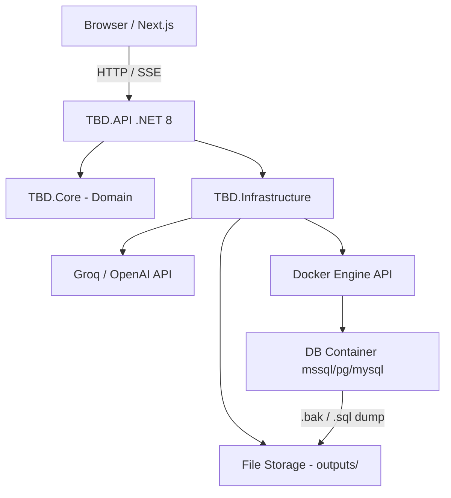

# Namines — Sistem Tasarım Planı
> AI Destekli İnteraktif Veritabanı Mimari Oluşturucu

---

## 1. Genel Mimari



**İletişim protokolleri:**
- Senkron kısa işler → REST (schema generate, lint, compile)
- Uzun işler (Docker sandbox) → SSE stream (`/api/docker/stream/{jobId}`)
- Real-time linter → Debounced REST (500ms delay, client-side trigger)

---

## 2. Backend Klasör Yapısı

```
backend/
├── TBD.sln
├── TBD.API/                          # Sunum Katmanı
│   ├── Controllers/
│   │   ├── SchemaController.cs       # POST /api/schema/generate, /api/schema/revise
│   │   ├── LintController.cs         # POST /api/lint
│   │   ├── CompileController.cs      # POST /api/compile/sql, /efcore
│   │   ├── DockerController.cs       # POST /api/docker/run, GET /api/docker/stream/{id}
│   │   └── DocumentationController.cs# POST /api/docs/generate
│   ├── Hubs/
│   │   └── SchemaHub.cs              # (Opsiyonel) SignalR - Docker job progress
│   ├── Middleware/
│   │   └── ExceptionMiddleware.cs
│   ├── Extensions/
│   │   └── ServiceCollectionExtensions.cs  # DI kayıt merkezi
│   └── Program.cs
│
├── TBD.Core/                         # Domain Katmanı (bağımlılıksız)
│   ├── Entities/
│   │   ├── SchemaTable.cs
│   │   ├── SchemaColumn.cs
│   │   └── SchemaRelation.cs
│   ├── Models/                       # Request/Response DTO'ları
│   │   ├── DatabaseSchema.cs         # ★ Ana JSON sözleşmesi
│   │   ├── GenerateRequest.cs
│   │   ├── ReviseRequest.cs
│   │   ├── CompileRequest.cs
│   │   ├── LintResult.cs
│   │   └── DockerJobResult.cs
│   ├── Interfaces/
│   │   ├── IAIService.cs
│   │   ├── IDockerService.cs
│   │   ├── IDdlGenerator.cs
│   │   ├── IEfCoreGenerator.cs
│   │   └── IDocumentationService.cs
│   ├── Enums/
│   │   ├── DatabaseType.cs           # MSSQL, PostgreSQL, MySQL
│   │   ├── ColumnType.cs             # INT, VARCHAR, DATETIME...
│   │   └── RelationshipType.cs       # OneToMany, ManyToMany
│   └── Prompts/                      # ★ Prompt mimarisi buraya
│       ├── SchemaPromptBuilder.cs
│       ├── RevisionPromptBuilder.cs
│       └── MockDataPromptBuilder.cs
│
└── TBD.Infrastructure/               # Altyapı Katmanı
    ├── AI/
    │   ├── GroqAIService.cs
    │   └── OpenAIService.cs
    ├── Docker/
    │   ├── DockerService.cs           # Docker.DotNet kütüphanesi
    │   └── ContainerProfiles.cs       # Image configs per DB type
    ├── Generators/
    │   ├── DdlGenerator/
    │   │   ├── MssqlDdlGenerator.cs
    │   │   ├── PostgresDdlGenerator.cs
    │   │   └── MySqlDdlGenerator.cs
    │   ├── EfCoreGenerator/
    │   │   ├── DbContextGenerator.cs
    │   │   └── ModelClassGenerator.cs
    │   └── DocumentationGenerator/
    │       ├── PdfReportGenerator.cs
    │       ├── MermaidErGenerator.cs
    │       └── ReadmeGenerator.cs
    └── Storage/
        └── FileStorageService.cs      # outputs/ klasörüne yazar, download URL döner
```

---

## 3. Frontend Klasör Yapısı

```
frontend/
├── app/
│   ├── page.tsx                      # Landing — prompt giriş ekranı
│   ├── canvas/
│   │   └── page.tsx                  # React Flow canvas (ana çalışma ekranı)
│   ├── compile/
│   │   └── page.tsx                  # SQL / EF Core çıktı ekranı
│   └── layout.tsx
│
├── components/
│   ├── landing/
│   │   ├── PromptInput.tsx           # Textarea + sesli kayıt butonu
│   │   ├── VoiceRecorder.tsx         # MediaRecorder → Whisper API
│   │   └── TemplateGrid.tsx          # Hazır şablon kartları
│   ├── canvas/
│   │   ├── SchemaCanvas.tsx          # ★ Ana ReactFlow wrapper
│   │   ├── nodes/
│   │   │   └── TableNode.tsx         # Custom node — tablo kartı
│   │   ├── edges/
│   │   │   └── RelationEdge.tsx      # Custom edge — 1:N / N:M etiketi
│   │   ├── panels/
│   │   │   ├── ToolbarPanel.tsx      # Zoom, layout, onay butonu
│   │   │   ├── RegionalPromptPanel.tsx # Shift+click seçim sonrası AI prompt
│   │   │   └── LinterPanel.tsx       # Hata uyarıları overlay
│   │   └── sidebar/
│   │       └── ColumnEditor.tsx      # Kolon detay düzenleme drawer
│   └── compile/
│       ├── DbTypeSelector.tsx
│       ├── SqlPreview.tsx            # Syntax highlighted DDL
│       └── OutputActions.tsx         # İndir / Kopyala / Docker Run
│
├── store/                            # ★ Zustand state yönetimi
│   ├── useSchemaStore.ts             # nodes, edges, selectedTables, schema JSON
│   └── useLinterStore.ts             # lintErrors[], isLinting
│
├── hooks/
│   ├── useAIGenerate.ts              # İlk schema üretimi
│   ├── useAIRevise.ts                # Bölgesel AI revizyonu
│   └── useLinter.ts                  # Debounced lint tetikleyici
│
├── services/
│   └── api.ts                        # Axios instance + tüm endpoint çağrıları
│
├── types/
│   └── schema.ts                     # DatabaseSchema, Table, Column, Relation TS tipleri
│
└── lib/
    ├── schemaToFlow.ts               # ★ JSON Schema → RF nodes[] + edges[]
    └── flowToSchema.ts               # ★ RF nodes[] + edges[] → JSON Schema
```

---

## 4. Ana JSON Sözleşmesi (DatabaseSchema)

```json
{
  "schemaId": "uuid-v4",
  "name": "E-Ticaret Sistemi",
  "tables": [
    {
      "id": "tbl_users",
      "name": "Users",
      "columns": [
        { "id": "col_1", "name": "Id",       "type": "INT",     "isPK": true,  "isFK": false, "isNullable": false, "defaultValue": null },
        { "id": "col_2", "name": "Email",     "type": "VARCHAR", "length": 255, "isPK": false, "isFK": false, "isNullable": false },
        { "id": "col_3", "name": "CreatedAt", "type": "DATETIME","isPK": false, "isFK": false, "isNullable": false }
      ]
    },
    {
      "id": "tbl_orders",
      "name": "Orders",
      "columns": [
        { "id": "col_4", "name": "Id",      "type": "INT", "isPK": true,  "isFK": false, "isNullable": false },
        { "id": "col_5", "name": "UserId",  "type": "INT", "isPK": false, "isFK": true,  "isNullable": false }
      ]
    }
  ],
  "relations": [
    {
      "id": "rel_1",
      "type": "OneToMany",
      "sourceTableId": "tbl_users",
      "sourceColumnId": "col_1",
      "targetTableId": "tbl_orders",
      "targetColumnId": "col_5"
    }
  ]
}
```

---

## 5. AI Prompt Mimarisi

### 5a. İlk Şema Üretimi (SchemaPromptBuilder)

```
SYSTEM:
  Sen bir veritabanı mimarı asistanısın.
  SADECE geçerli JSON döndür. Markdown, açıklama, başka metin YOK.
  Çıktı formatı kesinlikle şu şema ile uyumlu olmalı: [DatabaseSchema JSON şeması]

USER:
  Kullanıcı isteği: "{userPrompt}"
  Hedef veritabanı: "{dbType}"
  
  JSON şemasını oluştur. Tablolar normalleştirilmiş olmalı (3NF).
  Her tablo için PK zorunlu. FK'lar ilişkilerde belirtilmeli.
```

### 5b. Bölgesel Revizyon (RevisionPromptBuilder)

```
SYSTEM:
  Mevcut bir veritabanı şemasının YALNIZCA belirtilen tablolarını revize et.
  Diğer tabloları değiştirme. SADECE JSON döndür.

USER:
  Mevcut seçili tablolar:
  {selectedTablesJson}

  Kullanıcı isteği: "{revisionPrompt}"
  
  Yalnızca bu tabloları ve aralarındaki ilişkileri güncelle.
  Yeni tablolar ekleyebilirsin ama var olan id'leri koru.
```

### 5c. Linter (Kural bazlı — AI yok)
Linter, backend'de **saf C# kural motoru** olarak çalışır (AI API masrafı yok):
- FK tipi ≠ referans PK tipi → hata
- Çift PK → hata
- Döngüsel FK → uyarı
- Adlandırma kuralları ihlali → uyarı

---

## 6. C# Backend → Docker API İletişimi

**Kullanılan kütüphane:** `Docker.DotNet` (NuGet)

```
Akış:
1. DockerService.RunSandboxAsync(schema, dbType)
2.   → Docker daemon'a bağlan (unix:///var/run/docker.sock veya npipe://./pipe/docker_engine)
3.   → Pull image (mcr.microsoft.com/mssql/server:2022-latest)
4.   → CreateContainer (random port, env SA_PASSWORD, izole network)
5.   → StartContainer → WaitUntilHealthy (polling /health endpoint)
6.   → ExecInContainer: sqlcmd ile DDL scriptini çalıştır
7.   → ExecInContainer: BACKUP DATABASE ... TO DISK
8.   → CopyFileFromContainer → outputs/{jobId}.bak
9.   → StopContainer + RemoveContainer (cleanup)
10.  → FileStorageService.GetDownloadUrl(jobId) → return URL
```

**Güvenlik:** Her sandbox için izole Docker network. SA şifresi random UUID. Timeout 5 dakika.

---

## 7. Next.js React Flow State Yönetimi

**Zustand** (`useSchemaStore`) tek gerçek kaynağı (single source of truth):

```
useSchemaStore {
  // State
  schema: DatabaseSchema          // Backend JSON sözleşmesi
  nodes: Node[]                   // React Flow görsel state
  edges: Edge[]                   // React Flow görsel state
  selectedTableIds: string[]      // Shift+click seçimi
  isDirty: boolean                // Manuel düzenleme yapıldı mı

  // Actions
  loadFromSchema(json)            // AI yanıtı → store'a yükle (schemaToFlow çağırır)
  updateNodePosition(id, pos)     // Drag-drop → sadece görsel, schema dokunulmaz
  updateColumnName(tableId, colId, name) // Manuel edit → hem node hem schema güncelle
  addEdge(edge)                   // Yeni ilişki → schema.relations'a ekle
  removeEdge(edgeId)
  setSelectedTables(ids)          // Bölgesel prompt için
  applyRevision(partialSchema)    // AI revizyonu → sadece etkilenen tabloları merge et
  toSchema(): DatabaseSchema      // Compile için güncel JSON'u döndür
}
```

**Kritik akış:** `nodes/edges ←→ schema` senkronizasyonu `schemaToFlow.ts` ve `flowToSchema.ts` lib'leri ile yapılır. Canvas manipülasyonları direkt `schema`'yı değiştirmez — sadece `nodes/edges`'i değiştirir. Compile anında `flowToSchema()` çağrılır.

---

## 8. Geliştirme Aşamaları

| Faz | Süre | Hedef |
|-----|------|-------|
| **Faz 1** – Foundation | 1 hafta | Backend DI kurulumu, GroqAI entegrasyonu, `/api/schema/generate` çalışır hale gelir. Temel `DatabaseSchema` sözleşmesi test edilir. |
| **Faz 2** – Canvas | 1.5 hafta | Landing sayfası → Canvas geçişi. `TableNode`, `RelationEdge` custom componentler. `schemaToFlow` + Zustand store. Drag-drop, kolon düzenleme. |
| **Faz 3** – Linter & Revizyon | 1 hafta | C# kural motoru linter. `LinterPanel` overlay. `RegionalPromptPanel` + `/api/schema/revise` entegrasyonu. `applyRevision` merge mantığı. |
| **Faz 4** – Compile & Output | 1 hafta | DDL generator (MSSQL önce). EF Core generator. `SqlPreview` sayfası. İndirme sistemi. |
| **Faz 5** – Docker Sandbox | 1.5 hafta | `Docker.DotNet` entegrasyonu. SSE stream ile progress takibi. `.bak` / dump indirme. |
| **Faz 6** – Docs & Polish | 1 hafta | Mermaid ER diyagram. README generator. PDF rapor. Sesli komut (Whisper). Mock data. |

---

## 9. Teknoloji Kararları Özeti

| Karar | Seçim | Neden |
|-------|-------|-------|
| AI | Groq (primary) | Hız — llama-3.3-70b ile düşük latency JSON üretimi |
| State | Zustand | Boilerplate-free, React Flow ile uyumlu |
| Docker iletişim | Docker.DotNet | Resmi C# client, async/stream desteği |
| DDL üretimi | Template + string builder | AI çok hatalı üretir, rule-based daha güvenilir |
| Linter | Pure C# rules | AI API masrafı ve latency olmadan anlık feedback |
| PDF | QuestPDF | .NET 8 ile lisans sorunsuz, Fluent API |
| Frontend routing | App Router | Server components avantajı, streaming uyumu |
